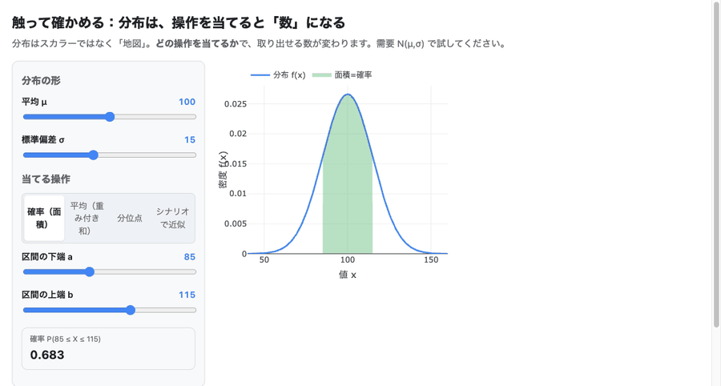

# 確率を、触って学ぶ。

**確率的最適化を、公式暗記でなく「不確実性を何で表し、何を大事にして決めるか」で学ぶ入門教材。**
電力・エネルギーへの応用つき。ブラウザで動くツールにインストールは要りません。

> **対象**：確率の基礎に不安はあるが、電力・制御・最適化に確率を応用したい人。
> **ゴール**：同じ意思決定問題を6形式で比べ、**「なぜこの形式を選ぶか」を自分の言葉で説明できる**こと。

---

## 👉 ここから始める

**[🎓 学習コースを開く](interactive/course.html){target=_blank}** — 読む→触る→自分の問題で使う→確かめる、の一本道（約40分）。

同じ需要予測でも、何を大事にするかで最適な備え方は 100 から 137 まで変わります。学習コースの中でこの違いを実際に動かして確かめられます。迷ったら、まずこのコースだけ開いてください。

---

## もっと詳しく知りたいなら

- 章立て・依存関係を俯瞰したい → [学習地図](roadmap/learning_map.md)
- 教材の設計方針・進捗の記録 → [development_log.md](development_log.md)
- ソースコード・環境構築・ライセンス → [GitHubリポジトリ](https://github.com/lutelute/lec_prob)
