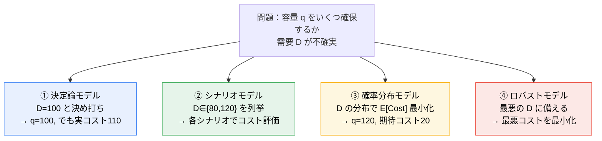
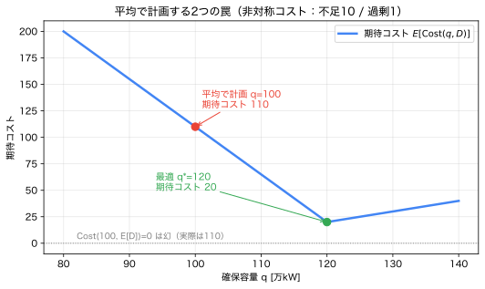

# 第0章 — なぜ確率が必要か

!!! abstract "30秒まとめ"
    - **何の話か**：決定論（平均だけで計画）は、いつ・なぜ壊れるか。
    - **分かること**：結果が非対称なら「平均で計画」は最適でない（平均の罠）。不確実性には偶然的（ばらつき）と認識論的（誤差）がある。
    - **使う場面**：需要・PV・価格など不確実な量を前提に計画を立てるとき。 → まず [確率の使い方](how_to_use_probability.md) を触る。

> **この教材を貫く5つの問い**（迷ったらここへ戻る）
> 1. 何が不確実なのか。
> 2. それを 事象 / 確率変数 / 分布 / シナリオ / 集合 のどれで表すか。
> 3. 平均・最悪・違反確率・尾部リスクのどれを重視するか。
> 4. その選択は 目的関数 / 制約 / 分布仮定 のどこに現れるか。
> 5. 代償（データ・計算量・保守性・仮定の脆さ）は何か。

第0章のゴールは公式を覚えることではありません。**「なぜ、わざわざ確率という面倒な言語を導入するのか」**に、自分の言葉で答えられるようになることです。

---

## 1. 現象・直感：決定論モデルはいつ壊れるか

**決定論モデル**とは、「入力を1つ決めれば出力が1つに定まる」モデルです。

$$
\text{入力（1つの値）} \;\longrightarrow\; \text{モデル} \;\longrightarrow\; \text{出力（1つの値）}
$$

これは入力が**本当に1つに定まるとき**だけ正しく機能します。たとえば「電気代 = 単価 × 使用量」は、単価も使用量も確定していれば完璧です。

問題は、現実の入力の多くが**事前には1つに定まらない**ことです。

| 場面 | 決定論が仮定すること | 現実 |
|---|---|---|
| 明日の電力需要 | 「ちょうど 100 万kW」 | 天候・曜日・経済で 80〜120 の幅 |
| 太陽光（PV）出力 | 「昼は定格の 70%」 | 雲一つで数秒で半減することも |
| 発電機の故障 | 「故障しない」 | 低確率だが起きると深刻 |
| 電力市場価格 | 「30 円/kWh」 | スパイクで 200 円超もありうる |

> **決定論モデルが壊れる条件**：
> ① 入力に無視できない**ばらつき**がある、かつ
> ② 結果が入力に対して**非線形・非対称**に反応する（特に「悪い方向」の代償が大きい）。
>
> この2つが揃うと、「代表値1つ」で計画した結果が、実際にはひどく外れます。次節でそれを数値で見ます。

---

## 2. 小さな数値例：平均で計画する2つの罠

電力会社が、明日の需要に備えて発電容量 $q$（万kW）を**前もって確保**する状況を考えます。
明日の需要 $D$ は、今日の時点では確定していません。簡単のため2通りとします。

$$
D = \begin{cases} 80 & \text{確率 } 0.5 \quad(\text{涼しい日})\\ 120 & \text{確率 } 0.5 \quad(\text{暑い日})\end{cases}
\qquad \Rightarrow \quad \text{平均需要 } E[D] = 100.
$$

確保した容量と実需要がずれると、コストが発生します。**ずれの向きで単価が違う**のが肝心です。

$$
\text{Cost}(q, D) = \underbrace{10 \cdot \max(D-q,\,0)}_{\text{不足（緊急調達・停電）}}
\;+\; \underbrace{1 \cdot \max(q-D,\,0)}_{\text{過剰（燃料・待機の無駄）}}
$$

- **不足** は 1 単位あたり **10**（緊急融通や供給支障は高くつく）。
- **過剰** は 1 単位あたり **1**（無駄だが軽い）。

不足が過剰の **10倍** 痛い、という**非対称性**がポイントです。

### 罠その1：平均で「評価」する罠（the flaw of averages）

うっかり、需要をその平均 $E[D]=100$ で固定し、$q=100$ を入れて評価すると：

$$
\text{Cost}(100,\, \underbrace{100}_{=E[D]}) = 10\cdot\max(0,0) + 1\cdot\max(0,0) = 0.
$$

「コスト0、完璧だ」と結論してしまいます。**しかしこれは幻です。** 実際の需要は 100 ちょうどには**決してならない**（80 か 120）。本当の期待コストは：

$$
E[\text{Cost}(100, D)] = 0.5\cdot\text{Cost}(100,80) + 0.5\cdot\text{Cost}(100,120)
$$
$$
= 0.5\cdot(1\cdot 20) + 0.5\cdot(10\cdot 20) = 0.5\cdot 20 + 0.5\cdot 200 = \boxed{110}.
$$

> **平均値を入力に代入したコスト（=0）と、コストの期待値（=110）は別物**です。
> 一般に、非線形な $\text{Cost}$ では
> $$ \text{Cost}(q,\, E[D]) \;\neq\; E[\text{Cost}(q, D)]. $$
> これを **平均の落とし穴（flaw of averages）** と呼びます。数学的には**イェンゼンの不等式**（第3章で再訪）の現れです。

### 罠その2：平均に向けて「最適化」する罠

では $q=100$（平均需要ぴったり）は、確保量として最善でしょうか。他の $q$ も試します。

| 確保量 $q$ | $D=80$ のコスト | $D=120$ のコスト | 期待コスト $E[\text{Cost}]$ |
|---|---|---|---|
| 80 | $0$ | $10\cdot 40=400$ | $200$ |
| 100（平均） | $1\cdot 20=20$ | $10\cdot 20=200$ | $110$ |
| **120** | $1\cdot 40=40$ | $0$ | $\boxed{20}$ |
| 140 | $1\cdot 60=60$ | $1\cdot 20=20$ | $40$ |

**最善は $q^\*=120$ で、期待コストは 20。** 平均向けの $q=100$（期待コスト 110）の **5.5分の1** です。

なぜ最適確保量が平均 100 ではなく上振れ側の 120 なのか？　**不足が10倍痛いから、安全側（多め）に倒すべき**だからです。この「どれだけ多めにするか」は、後で**臨界比**

$$
\frac{c_{\text{不足}}}{c_{\text{不足}}+c_{\text{過剰}}} = \frac{10}{10+1} \approx 0.91
$$

という分位点（需要分布の上位91%点）で決まることを 第6章で学びます。いまは結論だけ：

> **平均に向けて最適化するのは、たいてい最適ではない。**
> 正しい意思決定は「分布の形」と「結果の非対称性」の両方に依存する。
> だから、平均という1つの数では足りず、**分布そのもの**が要る。

この一例だけで、確率を導入する動機が出そろいました。次に、その確率を**どう表すか**を整理します。

---

## 3. 図・可視化：不確実性を表す4つの解像度

同じ「明日の需要」を、情報の細かさ（解像度）の順に4通りで表せます。

```
① 観測値        ② 予測値          ③ 確率分布              ④ シナリオ
（過去の事実）   （未来の点推定）   （未来のばらつき全体）    （分布の有限近似）

  D = 96          D̂ = 100          f_D(x)                   D ∈ {80, 120}
  （昨日の値）     「だいたい100」    ╱▔╲ なだらかな山        重み {0.5, 0.5}
                                    ╱   ╲
   ●               ●               ╱     ╲                  ●        ●
                                  ╱       ╲                0.5      0.5
 確定した数      1つの数で代表    起こりやすさの地図        計算できる粒に砕く
```

| 表現 | 何を表すか | 時制 | 主な用途 | 限界 |
|---|---|---|---|---|
| **① 観測値** | 実際に起きた1つの値 | 過去 | データ・検証 | 過去は未来を保証しない |
| **② 予測値（点推定）** | 未来の代表値1つ | 未来 | 決定論モデルの入力 | ばらつき・非対称を捨てている |
| **③ 確率分布** | 未来のあらゆる値の起こりやすさ | 未来 | 期待値・確率・リスク計算 | 分布を知る／仮定する必要 |
| **④ シナリオ** | 分布を有限個の代表点＋確率に圧縮 | 未来 | 計算可能な最適化 | 粗いと尾部を取り逃す |

> **重要な区別**
> - 「**未来が不明**」＝ ②の予測値が外れること。決定論はこれに無力。
> - 「**確率的に表現する**」＝ ③のように、不明さを**起こりやすさの地図**として書き下すこと。
> - ④は③を**捨てている**のではなく、**離散的に近似**している（第5章）。
>
> 「不明」を放置するか、地図にするか。**確率とは、不明さに構造を与える言語**です。

---

## 4. 数学的定義（軽め）：不確実性の2分類

不確実性は、性質の違う2種類に分けると扱いやすくなります。

### 4.1 偶然的不確実性（aleatory uncertainty）

- **本質的なランダムさ**。データを増やしても消えない（既約）。
- 例：明日の正確なPV出力、ある瞬間に故障が起きるか。
- 適切な表現：**確率分布**。「消せないので、起こりやすさを測る」。

### 4.2 認識論的不確実性（epistemic uncertainty）

- **知識不足**による不確実性。データ・研究で**減らせる**（可約）。
- 例：「需要分布の平均が正確に分からない」「PVパネルの劣化率が未知」。
- 適切な表現：**分布のパラメータの不確かさ**、または**分布の集合（曖昧性集合）** → 分布ロバスト最適化（第6章）。

| | 偶然的 (aleatory) | 認識論的 (epistemic) |
|---|---|---|
| 由来 | 世界の本質的ランダム性 | 我々の知識不足 |
| データで減るか | 減らない | 減る |
| 表現 | 確率分布 $\mathbb{P}$ | 分布の族 $\mathcal{P}$／パラメータ不確かさ |
| 対応する最適化 | 期待値最小化・CVaR・チャンス制約 | 分布ロバスト最適化 |

> **なぜこの分類が効くか**：「分布を信じてよいか？」の答えが変わるからです。
> 偶然的だけなら分布ベース（期待値・CVaR）でよい。認識論的が大きいなら、分布を1つに決めず**集合**で扱う（ロバスト系）。
> これは 第6章で「どの最適化形式を選ぶか」に直結します。

---

## 5. モデルの4類型：同じ問題、4つの構え

第2節の確保量問題を、4つのモデルがどう扱うかを比べます。



| モデル | 不確実性の扱い | 強み | 弱み | 本教材の対応 |
|---|---|---|---|---|
| ① 決定論 | 代表値1つに固定 | 単純・高速 | ばらつき・非対称に脆い | 第0章, 第6章 比較対象 |
| ② シナリオ | 有限個の場合を列挙 | 直感的・計算可能 | シナリオ選びが命 | 第5章 |
| ③ 確率分布 | 分布で期待値・確率を計算 | 平均・リスクを定量化 | 分布を知る必要 | 第2章–第4章, 第6章 |
| ④ ロバスト | 最悪ケースに備える | 分布不要・安全 | 過度に保守的になりがち | 第6章 |

> ①→④ に進むほど「安全だが保守的・高コスト」に寄ります。**どこで止めるか**が意思決定者の判断であり、その判断を支えるのが 第1章–6 です。

---

## 6. Python による確認


*図：確保容量 $q$ に対する期待コスト。平均で計画した $q=100$（赤, コスト110）より最適 $q^\*=120$（緑, コスト20）が良い。「$\text{Cost}(100,E[D])=0$」は幻。（再生成：`python scripts/00_flaw_of_averages.py`）*

第2節の表（期待コスト）を数値実験で再現し、「平均で評価／最適化する罠」を一望します。
（実行には `numpy` のみ。`scripts/00_flaw_of_averages.py` として保存予定。）

```python
import numpy as np

# 需要の分布（2点）：値と確率
D_vals = np.array([80.0, 120.0])
D_prob = np.array([0.5, 0.5])

c_short, c_over = 10.0, 1.0  # 不足・過剰の単価（非対称）

def cost(q, D):
    return c_short * np.maximum(D - q, 0) + c_over * np.maximum(q - D, 0)

def expected_cost(q):
    return np.sum(D_prob * cost(q, D_vals))

mean_D = np.sum(D_prob * D_vals)                 # = 100
print("平均需要 E[D] =", mean_D)

# 罠1：平均を代入したコスト vs コストの期待値
print("Cost(100, E[D]) =", cost(100, mean_D))    # → 0（幻）
print("E[Cost(100, D)] =", expected_cost(100))   # → 110（実際）

# 罠2：最適な確保量を全探索
qs = np.arange(80, 141)
ec = np.array([expected_cost(q) for q in qs])
q_star = qs[np.argmin(ec)]
print("最適 q* =", q_star, " 期待コスト =", round(expected_cost(q_star), 2))
# 実際の出力:
#   平均需要 E[D] = 100.0
#   Cost(100, E[D]) = 0.0       ← 幻（平均を代入したコスト）
#   E[Cost(100, D)] = 110.0     ← 実際の期待コスト
#   最適 q* = 120  期待コスト = 20.0
```

**観察してほしいこと**
- `Cost(100, E[D]) = 0` と `E[Cost(100,D)] = 110` の食い違い ＝ 平均の落とし穴。
- 最適 `q* = 120`（平均 100 ではない）＝ 非対称コストが安全側へ意思決定をずらす。
- 単価 `c_short` を 10 → 1 に下げると `q*` が 100 側へ動く。**結果の非対称性が消えれば、平均で計画しても悪くない**ことを確認できる（決定論が壊れない条件の裏返し）。

---

## 7. 電力・エネルギーシステムへの接続

第2節は「予備力（リザーブ）確保」の最小モデルそのものです。実システムでは不確実性が層をなします。

| 不確実な量 $\xi$ | 性質 | 典型的な表現 | 非対称な代償 |
|---|---|---|---|
| 電力需要 $D$ | 偶然的＋認識論的 | 分布／シナリオ | 不足（停電）≫ 過剰 |
| PV・風力出力 | 偶然的（気象） | 分布／シナリオ | 急減で需給逼迫 |
| 発電機・設備故障 | 偶然的（希少事象） | 事象＋確率（第1章） | 1件で大規模波及 |
| 市場価格 | 偶然的＋認識論的 | 重い裾の分布 | 価格スパイク時の損失 |
| 周波数・潮流制約 | （上の結果として）制約 | チャンス制約／ロバスト | 制約違反＝設備保護・停電 |

> 電力システムで確率が不可欠なのは、まさに第1節の2条件が常に揃うからです。
> ① 需要・再エネ・故障・価格は**大きくばらつき**、② 供給支障・設備損傷の代償は**極端に非対称**。
> だから「点予測で運用」は、平均の落とし穴に正面からはまります。これが 第6章までの全体動機です。

---

## 8. 理解確認問題

> 詳しい解答は [`exercises/solutions/00_why_probability_solutions.md`](../exercises/solutions/00_why_probability_solutions.md)。
> まず自分の言葉で答えてから確認してください。

### 初級
1. 「決定論モデルが壊れる2つの条件」を挙げ、身近な例を1つ作りなさい。
2. 観測値・予測値・確率分布・シナリオを、それぞれ1文で説明しなさい。
3. 「未来が不明」と「確率的に表現する」は何が違うか。

### 中級
4. 第2節の2点需要 $D\in\{80,120\}$ のままで、不足単価 $c_{\text{不足}}$ を 10 → 4 → 0.5 と動かしたとき、最適確保量 $q^\*$ はどう変わるか（Python で確認してよい）。**変化が「なめらか」ではなく、ある閾値で 120 から 80 へ一気に飛ぶ**のはなぜか。閾値の値も求めよ。（ヒント：$80\le q\le120$ で期待コストを $q$ の式に書き、傾きの符号を見る。）
5. 「平均で評価する罠」と「平均で最適化する罠」は別物である。第2節の数値を使って、両者を1つずつ具体的に指摘せよ。

### 発展
6. ある量の不確実性が「偶然的か認識論的か」で、推奨される最適化形式（分布ベース か ロバスト系か）がなぜ変わるのか。PVパネルの「瞬時出力」と「経年劣化率」を例に説明せよ。
7. 決定論モデルが**それでも妥当**になるのはどんなときか。第6節の Python 実験（`c_short` を下げる）と関連づけて述べよ。

---

## 9. よくある誤解

| 誤解 | 正しい理解 |
|---|---|
| 「平均需要で計画すれば平均的には正しい」 | $\text{Cost}(q,E[D]) \ne E[\text{Cost}(q,D)]$。非線形・非対称だと平均計画は最適でない。 |
| 「予測精度を上げれば確率は要らない」 | 偶然的不確実性は精度向上では消えない。残るばらつきを確率で扱う必要がある。 |
| 「確率を使う＝未来を当てる」 | 確率は未来を**当てない**。起こりやすさの地図を与え、意思決定を支えるだけ。 |
| 「シナリオを使うのは分布を諦めたから」 | シナリオは分布の**離散近似**。捨てたのではなく、計算可能にしている（第5章）。 |
| 「ロバスト（最悪対応）が常に安全で良い」 | 最悪に備えると過剰投資になりうる。安全と費用のトレードオフ（第6章）。 |

---

## 章末セルフチェック

自分で答えてから開いてください（[▶ 全体の理解度チェック8問](../interactive/quiz.html)）。

??? question "Q1. 決定論モデル（平均で計画）が壊れるのはどんなとき？"
    入力が**不確実**で、かつ結果が**非対称**なとき。平均で計画すると最適でなく、実際の期待費用が悪化する（＝平均の罠）。

??? question "Q2.「未来が分からない」と「確率で表す」はどう違う？"
    前者はただの無知。後者は各結果の**起こりやすさを数で与える**こと。確率化して初めて期待値・分位点・リスクが計算でき、決定に使える。

## 10. まとめと次の一手

- 確率が要るのは、**ばらつき**と**結果の非対称性**が揃い、点予測では意思決定を誤るから。
- 不確実性は **観測値／予測値／分布／シナリオ** の4解像度、性質は **偶然的／認識論的** の2種で整理できる。
- 「平均で評価／最適化」には罠がある。正しい意思決定は**分布の形と非対称性**に依存する。

> **次へ**：では不確実性を表す最初の言語、**事象と確率**を厳密にします。
> 「事象」と「確率変数」は何が違うのか——ここを曖昧にしたまま進むと 第2章 以降で必ずつまずきます。
> → [01_events_and_probability](01_events_and_probability.md)

### この章で「言えたら合格」
> 「決定論モデルは **ばらつき＋非対称な代償** があると壊れる。だから、平均という1点ではなく**分布**を扱う確率が要る。」
