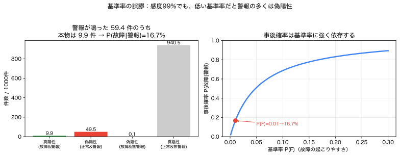

# Module 1 — 事象と確率

!!! abstract "30秒まとめ"
    - **何の話か**：事象（起こる/起こらない）と確率変数の違い、条件付き確率とベイズ。
    - **分かること**：感度の高い検査でも、稀な事象では「陽性≠本物」（基準率の誤謬）。
    - **使う場面**：故障・停電など「起こるか否か」を扱うとき。 → [▶ ベイズ更新ツール](../interactive/index.md) で体感。

> **5つの問い**：①何が不確実か ②どの言語で表すか ③何を良しとするか ④式のどこに出るか ⑤代償は何か。
> この Module は **②の最初の言語＝「事象」** を厳密にします。

Module 0 で「確率という言語が要る」と分かりました。その言語の**最小単位**が、本 Module の主役 **事象（event）** と **確率（probability）** です。ここを曖昧にすると、Module 2 の確率変数・分布で必ず行き詰まります。

---

## 1. 現象・直感：なぜ「事象」を厳密にするのか

Module 0 の保護リレー（故障検知）を思い出します。現場で人はこう言います。

> 「**故障が起きる**確率は？」「**警報が鳴ったとき**、本当に故障している確率は？」

この2つは別の確率です。後者は「警報が鳴った」という**条件のもとで**「故障している」を問うています。こうした問いを取り違えずに計算するには、「故障」「警報」といった**起こりうる事柄を集合として正確に書く**必要があります。それが事象です。

---

## 2. 標本空間・標本点・事象

### 2.1 定義

| 用語 | 記号 | 意味 | 一言 |
|---|---|---|---|
| 標本空間 | $\Omega$ | 起こりうる結果**すべて**の集合 | 「場合分けの全体」 |
| 標本点 | $\omega$ | $\Omega$ の1要素＝1つの結果 | 「世界が1つに定まった姿」 |
| 事象 | $A \subseteq \Omega$ | 結果の集まり（$\Omega$ の部分集合） | 「ある条件を満たす結果の集合」 |

> **事象は集合である。** これが Module 1 で最初に身体化すべき一点です。
> 「故障する」という事象は、「故障が起きる結果 $\omega$ をすべて集めた集合」です。

### 2.2 例で書き下す

**例A：サイコロ1個**
$$\Omega = \{1,2,3,4,5,6\}, \quad \omega = 3 \ (\text{出た目}), \quad A = \{2,4,6\}\ (\text{「偶数」という事象}).$$

**例B：発電機3台の稼働/故障**（電力例）
各機が「稼働 O」か「故障 X」。標本点は3文字の並び：
$$\Omega = \{OOO,\ OOX,\ OXO,\ XOO,\ OXX,\ XOX,\ XXO,\ XXX\}\quad (|\Omega|=2^3=8).$$
- 事象「ちょうど1台故障」 $= \{OOX, OXO, XOO\}$。
- 事象「2台以上故障（重大）」 $= \{OXX, XOX, XXO, XXX\}$。

**例C：明日の最大需要**（電力例）
$$\Omega = [0, \infty)\ (\text{連続}), \quad A = \{D : D > 110\}\ (\text{「ピーク超過」という事象}).$$
連続標本空間は Module 2 で本格的に扱いますが、「事象＝条件を満たす結果の集合」という捉え方は同じです。

---

## 3. 図・可視化：ベン図と確率の規則

事象は集合なので、**ベン図**で操作が見えます。

```
        Ω（長方形の内側すべて）
   ┌───────────────────────────┐
   │     ┌─────────┐             │
   │     │   A     │┌─────────┐  │
   │     │     ┌───┼┼──┐      │  │
   │     │     │ A∩B │ │  B   │  │
   │     │     └───┼┼──┘      │  │
   │     └─────────┘└─────────┘  │
   │           A∪B = A と B の合併  │
   └───────────────────────────┘
         A^c = A の外側すべて
```

| 操作 | 記号 | 意味 | 確率の規則 |
|---|---|---|---|
| 補 | $A^c$ | $A$ が起きない | $P(A^c) = 1 - P(A)$ |
| 和 | $A\cup B$ | $A$ または $B$ | $P(A\cup B)=P(A)+P(B)-P(A\cap B)$ |
| 積 | $A\cap B$ | $A$ かつ $B$ | 独立なら $=P(A)P(B)$（後述） |
| 排反 | $A\cap B=\varnothing$ | 同時には起きない | $P(A\cup B)=P(A)+P(B)$ |

### 確率の公理（コルモゴロフ、最小限）

確率 $P$ は事象に数を割り当てる関数で、次を満たします。

1. $0 \le P(A) \le 1$ （確率は0〜1）
2. $P(\Omega) = 1$ （何かは必ず起こる）
3. 排反な事象 $A_1, A_2,\dots$ に対し $P(\bigcup_i A_i) = \sum_i P(A_i)$ （排反なら足せる）

> たったこれだけから、上の規則（補・和）はすべて導けます。確率は「面積」だと思うと直感が合います（全体の面積が1のベン図）。

---

## 4. 【最重要】事象 と 確率変数 は何が違うか

この教材で最も多くの人がつまずく区別です。先に結論を表で。

| | 事象 $A$ | 確率変数 $X$ |
|---|---|---|
| 正体 | $\Omega$ の**部分集合**（集合） | $\Omega \to \mathbb{R}$ の**写像**（関数） |
| 答える問い | 「起きた？」→ **はい/いいえ** | 「いくつ？」→ **数値** |
| 例 | 「2台以上故障」$=\{OXX,\dots\}$ | 「故障台数」$X(\omega)$（0,1,2,3） |
| 確率の付き方 | $P(A)$（1つの数） | 分布 $p_X(x)$（値ごとに数） |

### つながり：両者は表裏一体

確率変数 $X$ があれば、そこから**事象を作れます**。たとえば「故障台数 $X$ が2以上」は事象：
$$
\{X \ge 2\} \;:=\; \{\omega \in \Omega : X(\omega) \ge 2\} = \{OXX, XOX, XXO, XXX\}.
$$
逆に、事象 $A$ があれば、そこから**確率変数を作れます**。**指示関数（indicator）**
$$
\mathbb{1}_A(\omega) = \begin{cases} 1 & \omega \in A\\ 0 & \omega \notin A\end{cases}
$$
は、$A$ が起きたら1・起きなければ0を返す確率変数です。しかも $E[\mathbb{1}_A] = P(A)$ という美しい橋がかかります（期待値は Module 3）。

> **覚え方**：事象は「世界を yes/no で切る集合」、確率変数は「世界に数値を貼る関数」。
> 確率変数を**閾値で切る**と事象になる（$\{X \ge 2\}$）。これが Module 2 の区間確率 $P(a \le X \le b)$ の正体です。

---

## 5. 条件付き確率：何が固定されているのか

### 5.1 定義

事象 $B$ が起きたと**分かった**もとでの $A$ の確率：
$$
P(A \mid B) = \frac{P(A \cap B)}{P(B)} \qquad (P(B) > 0).
$$
> **意味**：分母を「全体 $\Omega$」から「$B$ の世界」へ取り替える。$B$ が新しい全体になり、その中で $A$（正確には $A\cap B$）の割合を測り直す。

```
条件付けの直感：世界が Ω から B に縮む

  元の世界 Ω                B が起きたと判明
  ┌────────────┐           ┌────────┐  ← これが新しい「全体」
  │  ┌──┐      │    →      │ ┌──┐   │
  │  │A∩B│  B   │           │ │A∩B│  │   P(A|B) = A∩B の割合
  │  └──┘      │           │ └──┘   │            （Bの中で）
  └────────────┘           └────────┘
```

### 5.2 「何が固定されているか」を言葉で

$P(A\mid B)$ で**固定されている（条件として与えられた）のは $B$** です。$B$ はもう「起きた既知の事実」。問うているのは $A$ の方。
この主語・述語を取り違えると、次の**よくある事故**が起きます。

$$
P(A\mid B) \;\neq\; P(B\mid A) \quad(\text{一般に}).
$$

例：$P(\text{警報}\mid\text{故障})$（センサ性能、高い）と $P(\text{故障}\mid\text{警報})$（本当に知りたい量、低いことも）は**まったく別**。両者を結ぶのが次のベイズの定理です。

### 5.3 乗法公式と全確率の公式

- **乗法公式**：$P(A\cap B) = P(A\mid B)\,P(B) = P(B\mid A)\,P(A)$
- **全確率の公式**：$B_1,\dots,B_n$ が $\Omega$ を排反に分割するとき
$$
P(A) = \sum_{i=1}^n P(A\mid B_i)\,P(B_i).
$$
> 全確率の公式は「場合分けして足し上げる」。故障あり/なしで場合分けして警報確率を組み立てる、といった使い方をします（次節）。

---

## 6. ベイズの定理：基準率の効果


*図（左）1000件あたり、警報の多くは偽陽性（基準率1%・感度99%・誤警報5%で本物は59.4件中9.9件＝16.7%）。（右）事後確率は基準率に強く依存。（再生成：`python scripts/01_bayes_base_rate.py`）*

### 6.1 定理

$$
\boxed{\;P(B\mid A) = \frac{P(A\mid B)\,P(B)}{P(A)} = \frac{P(A\mid B)\,P(B)}{\sum_i P(A\mid B_i)P(B_i)}\;}
$$
> **意味**：知りたい向き $P(B\mid A)$ を、測りやすい向き $P(A\mid B)$ と事前確率 $P(B)$ から組み立て直す。
> $P(B)$ を**事前確率**（データを見る前）、$P(B\mid A)$ を**事後確率**（$A$ を見た後）と呼ぶ。

### 6.2 電力例：保護リレーの誤報（基準率の誤謬）

ある送電線の保護リレーを考えます。

- 故障の基準率：$P(F) = 0.01$（その時間帯に故障が起きるのは1%）。
- リレー感度：$P(\text{警報}\mid F) = 0.99$（故障なら99%警報）。
- 誤警報率：$P(\text{警報}\mid F^c) = 0.05$（故障なしでも5%は警報）。

**警報が鳴った。本当に故障している確率は？**

全確率の公式で分母（警報が鳴る確率）を作る：
$$
P(\text{警報}) = \underbrace{0.99\times 0.01}_{\text{真の故障}} + \underbrace{0.05\times 0.99}_{\text{誤警報}} = 0.0099 + 0.0495 = 0.0594.
$$
ベイズで反転：
$$
P(F\mid \text{警報}) = \frac{0.99\times 0.01}{0.0594} = \frac{0.0099}{0.0594} \approx \boxed{0.167}.
$$

> **直感に反する結論**：感度99%の優秀なセンサでも、警報が鳴って実際に故障なのは**約17%**。
> 理由は**基準率が低い（1%）**から。母数の大きい「故障なし99%」のうち5%が誤警報を出し、その数（0.0495）が真の故障（0.0099）を**圧倒**する。
> これが **基準率の誤謬（base-rate fallacy）**。電力現場の「警報の洪水」「不要動作（nuisance trip）」問題の数理的核心です。

```
1000 回のうち（基準率 1%）
  故障 10 回 ─┬─ 警報   9.9回  ← 真陽性
              └─ 無警報 0.1回
  正常 990回 ─┬─ 警報  49.5回  ← 偽陽性（こちらが多い！）
              └─ 無警報940.5回
  警報が鳴った 59.4回のうち、真の故障は 9.9回 → 9.9/59.4 ≈ 16.7%
```

> **設計への示唆**：警報の信頼度を上げるには、誤警報率 $P(\text{警報}\mid F^c)$ を下げるのが効く（基準率が低い領域では感度より特異度が効く）。これは確率計算が**設計判断**に直結する好例です。

---

## 7. 独立性：定義と「無相関」との違い

### 7.1 事象の独立

事象 $A, B$ が**独立**とは：
$$
P(A\cap B) = P(A)\,P(B), \quad\text{同値に}\quad P(A\mid B)=P(A)\ (P(B)>0).
$$
> **意味**：$B$ を知っても $A$ の確率が変わらない。「情報を持たない」関係。

**例（独立）**：サイコロ2個。$A=$「1個目が偶数」、$B=$「2個の和が7」。
$$P(A)=\tfrac12,\ P(B)=\tfrac16,\ P(A\cap B)=\tfrac{1}{12}=P(A)P(B)\ \Rightarrow\ \text{独立}.$$
**例（従属）**：$A=$「1個目が偶数」、$B'=$「和が8」。
$$P(A)P(B')=\tfrac12\cdot\tfrac{5}{36}=\tfrac{5}{72},\quad P(A\cap B')=\tfrac{3}{36}=\tfrac{6}{72}\neq\tfrac{5}{72}\ \Rightarrow\ \text{従属}.$$

> 「和が7」が独立で「和が8」が従属、というのは直感では出ません。**独立は計算で確かめる関係**であって、見た目の無関係さではない、という教訓です。

### 7.2 独立 と 無相関 は違う

ここは「必ず扱う問い」です。結論：

$$
\textbf{独立} \;\Longrightarrow\; \textbf{無相関}, \qquad \text{しかし逆は一般に偽}.
$$

- **独立**：分布が完全に分離（$B$ を知っても $A$ の確率が一切変わらない）。**あらゆる依存**が無い。
- **無相関**：相関係数 $\rho=0$。これは**線形の**連動が無いだけ。非線形な依存は残りうる。

直感的反例（詳細と計算は [03_expectation_variance_covariance](03_expectation_variance_covariance.md)）：
$X$ を $\{-1,0,1\}$ 上で対称にとり $Y=X^2$ とすると、$Y$ は $X$ で**完全に決まる**（強く従属）のに、対称性から $\mathrm{Cov}(X,Y)=0$（無相関）。
> **教訓**：「無相関だから独立に扱ってよい」は誤り。相関0は線形無関係を言うだけ。電力で需要と再エネ出力を「無相関だから別々に」と扱うと、非線形な共変動（猛暑×PV低下など）を見落とす危険があります。

---

## 8. 「確率0」と「起こりえない」は同じか

- **有限・可算な $\Omega$**：実用上 $P(A)=0$ は「起こらない」と扱ってよい（その結果に質量がない）。
- **連続な $\Omega$**：話が変わる。例えば $[0,1]$ 上で一様に点を選ぶと、**特定の点 $x$ ちょうど**が選ばれる確率は $P(\{x\})=0$。にもかかわらず、選ばれた点は必ずどこかにある＝「確率0の結果が実際に起きる」。

$$
P(X = x) = 0 \ \text{（連続変数）} \quad\not\Rightarrow\quad \text{「$X=x$ は起こりえない」}.
$$

> だから連続変数では**点の確率ではなく区間の確率**（面積）で考えます。$P(a\le X\le b)=\int_a^b f_X(x)\,dx$。
> この一点が Module 2 の核心（密度 ≠ 確率）に直結します。いまは「確率0＝不可能、ではない場面がある」と覚えてください。

---

## 9. Python による確認

```python
from itertools import product
from fractions import Fraction

# --- 独立性チェック（サイコロ2個）---
omega = list(product(range(1,7), repeat=2))   # 標本空間 |Ω|=36
def P(event):                                  # event: ω→True/False
    return Fraction(sum(event(w) for w in omega), len(omega))

A  = lambda w: w[0] % 2 == 0       # 1個目が偶数
B  = lambda w: sum(w) == 7         # 和が7
B2 = lambda w: sum(w) == 8         # 和が8
print("P(A)P(B)  =", P(A)*P(B),  " P(A∩B)  =", P(lambda w: A(w) and B(w)))   # 1/12 = 1/12 → 独立
print("P(A)P(B2) =", P(A)*P(B2), " P(A∩B2) =", P(lambda w: A(w) and B2(w)))  # 5/72 ≠ 6/72 → 従属

# --- ベイズ（保護リレー）---
PF, P_al_F, P_al_nF = 0.01, 0.99, 0.05
P_alarm = P_al_F*PF + P_al_nF*(1-PF)
print("P(警報)      =", round(P_alarm, 4))        # 0.0594
print("P(故障|警報) =", round(P_al_F*PF/P_alarm, 4))  # 0.1667
```

**観察ポイント**
- 「和が7」は独立、「和が8」は従属。独立は**計算で**判定する。
- 基準率 `PF` を 0.01 → 0.2 に上げると `P(故障|警報)` が急上昇する。**事後確率は基準率に強く依存**する。
- 誤警報率 `P_al_nF` を 0.05 → 0.005 に下げると、感度を上げるより事後確率が改善する場面がある。

---

## 10. 電力・エネルギーへの接続

| 確率の道具 | 電力での使いどころ |
|---|---|
| 事象・標本空間 | $N{-}1$ 基準（どれか1要素が脱落する事象の集合）、停電/非停電 |
| 補・和の規則 | 「少なくとも1台故障」$=1-P(\text{全台健全})$ |
| 条件付き確率 | 「猛暑のときのピーク超過確率」$P(D>110 \mid \text{猛暑})$ |
| 独立性 | 複数発電機の故障を独立と仮定（共通原因故障があると破綻、要注意） |
| ベイズ | 警報・センサ診断、状態推定、異常検知の事後確率 |
| 確率0≠不可能 | 連続量（需要・出力）の扱い → Module 2 の密度へ |

> **設計の勘所**：独立性の仮定は計算を劇的に楽にするが、**共通原因故障**（落雷で複数機停止、寒波で需要と設備トラブルが同時）では崩れる。「独立と置いてよいか」を毎回問うことが、確率モデリングの実務そのものです。

---

## 11. 理解確認問題

> 解答：[`exercises/solutions/01_events_and_probability_solutions.md`](../exercises/solutions/01_events_and_probability_solutions.md)

### 初級
1. 発電機2台（各 O/X）の標本空間 $\Omega$ を書き、「ちょうど1台故障」という事象を集合で書け。
2. 「事象」と「確率変数」を、それぞれ「集合」「写像」という語を使って1文で説明せよ。
3. $P(A)=0.3,\ P(B)=0.5,\ P(A\cap B)=0.2$ のとき $P(A\cup B)$ と $P(A^c)$ を求めよ。

### 中級
4. 保護リレーの例で、基準率 $P(F)$ を 0.01 から 0.10 に上げると $P(F\mid\text{警報})$ はいくつになるか。基準率が事後確率に与える影響を一言で述べよ。
5. $P(A\mid B)$ と $P(B\mid A)$ が一般に異なることを、保護リレーの数値（$P(\text{警報}\mid F)$ と $P(F\mid\text{警報})$）で具体的に示せ。
6. 「独立」と「無相関」の違いを、$Y=X^2$（$X\in\{-1,0,1\}$ 一様）の例で説明せよ（相関0だが従属、を指摘）。

### 発展
7. 3台の発電機が各々独立に確率 $p=0.05$ で故障する。「2台以上同時故障」の確率を求めよ。さらに、もし共通原因故障（確率 $0.02$ で3台同時停止）が加わると、この確率はどう変わるか定性的に論ぜよ。
8. 連続な需要 $D$ について「$P(D=100)=0$ なのに $D$ は必ず何らかの値をとる」を、Module 0 の意思決定（容量確保）と結びつけて、なぜ点ではなく区間・分布で考えるべきか論ぜよ。

---

## 12. よくある誤解

| 誤解 | 正しい理解 |
|---|---|
| 事象と確率変数は同じようなもの | 事象＝集合（yes/no）、確率変数＝写像（数値）。閾値で切ると確率変数→事象。 |
| $P(A\mid B)=P(B\mid A)$ | 一般に違う。ベイズで反転が必要。 |
| 条件付き確率は「$A$ と $B$ の両方が起きる確率」 | それは $P(A\cap B)$。条件付きは $B$ を**既知として固定**し $\Omega\to B$ に縮める。 |
| 感度99%の警報なら、鳴れば99%本物 | 基準率が低いと事後確率は大きく下がる（例：17%）。 |
| 無相関なら独立 | 独立⇒無相関だが逆は偽。無相関は線形依存ゼロのみ。 |
| 確率0なら絶対起きない | 連続変数では各点の確率は0でも、いずれかの点は起きる。 |

---

## 13. まとめと次の一手

- **事象は集合、確率は集合に割り当てる面積**。公理から補・和の規則が出る。
- **事象と確率変数の橋**：閾値で確率変数を切ると事象、事象の指示関数は確率変数で $E[\mathbb{1}_A]=P(A)$。
- **条件付き確率は世界を $B$ に縮める**操作。$P(A\mid B)\ne P(B\mid A)$、橋渡しがベイズ。
- **独立は計算で判定**、無相関とは別物。
- **確率0≠不可能**（連続）→ 点ではなく区間・密度へ。

> **次へ**：確率変数を主役にし、その分布を **PMF・PDF・CDF** で記述します。
> 最大の山は「**密度 $f_X(x)$ は確率ではない**」。確率は区間の面積——Module 1 の「確率0≠不可能」がここで効いてきます。
> → [02_random_variables_and_distributions](02_random_variables_and_distributions.md)
>
> あわせて、第1の可視化ツール **[PDF・CDF・区間確率ビジュアライザ](../apps/pdf_cdf_visualizer/README.md)** で、密度と面積の違いを手で動かして確かめます。

### この Module で「言えたら合格」
> 「事象は $\Omega$ の部分集合、確率変数は $\Omega$ 上の関数。条件付き確率は世界を $B$ に縮める操作で、$P(A\mid B)\ne P(B\mid A)$。独立は $P(A\cap B)=P(A)P(B)$ で、無相関より強い。」
