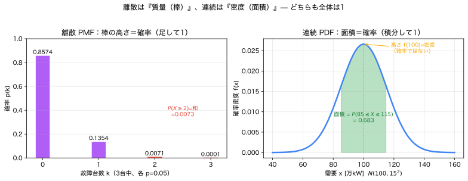
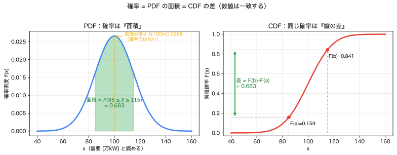

# Module 2 — 確率変数と分布

> **5つの問い**：①何が不確実か ②どの言語で表すか ③何を良しとするか ④式のどこに出るか ⑤代償は何か。
> この Module は **②の中核言語＝「確率変数とその分布」** を厳密にします。

Module 1 で「事象＝集合」を学びました。ここでは主役を **確率変数** に移し、その振る舞い全体を **分布**（PMF・PDF・CDF）で記述します。最大の山は——

> **密度 $f_X(x)$ は確率ではない。** 確率は区間の**面積**である。

これを身体化できれば、Module 6 のチャンス制約・CVaR まで一直線です。
本文と並行して、第1ツール **[PDF・CDF・区間確率ビジュアライザ](../apps/pdf_cdf_visualizer/README.md)** を必ず動かしてください。

---

## 1. 現象・直感：なぜ「分布」が要るか

Module 0 で「明日の需要は1つの数では足りず、分布が要る」と分かりました。では分布とは何を持っている情報なのか。

- 「需要が **ちょうど** 100 になる確率は？」→ 連続量では、これは **0**（Module 1 §8）。
- 「需要が **95〜105 に入る** 確率は？」→ これは意味がある。**区間**なら答えられる。
- 「需要が容量 **130 を超える** 確率は？」→ 供給支障の確率。**右裾**で答えられる。

分布とは、**こうした「区間・閾値の確率」をすべて一括で答えられる地図**です。その地図には3つの描き方（PMF・PDF・CDF）があり、**同じ情報の別表現**にすぎません。

---

## 2. 確率変数とは（Module 1 からの橋）

**確率変数** $X$ は、標本点に実数を割り当てる**写像**：
$$
X : \Omega \to \mathbb{R}, \qquad \omega \mapsto X(\omega).
$$
> 事象（集合）と違い、確率変数は**数値**を返す。Module 1 §4 の通り、確率変数を閾値で切ると事象になる：$\{X \le x\} = \{\omega : X(\omega)\le x\}$。

確率変数は値の取り方で2種類に分かれます。

| 種類 | 値の集合 | 例 | 記述する関数 |
|---|---|---|---|
| **離散** | とびとび（可算） | 故障台数、年間故障件数 | PMF $p_X$ |
| **連続** | 区間（非可算） | 需要、PV出力、価格、故障間隔 | PDF $f_X$ |

両方に共通して使えるのが **CDF** $F_X$ です。まず離散から。

---

## 3. 離散：確率質量関数 PMF


*図（左）離散は棒の高さがそのまま確率（足して1）。（右）連続は曲線の下の面積が確率（積分して1）、高さ＝密度は確率ではない。（再生成：`python scripts/02b_pmf_vs_pdf.py`）*

**確率質量関数 (PMF)**：
$$
p_X(x) = P(X = x), \qquad p_X(x)\ge 0, \quad \sum_x p_X(x) = 1.
$$
> **意味**：各値 $x$ に「**確率そのもの**」を割り当てる。棒の高さがそのまま確率。だから足して1。

### 例：発電機3台の故障台数（二項分布）
各機が独立に確率 $p=0.05$ で故障。故障台数 $X \sim \mathrm{Bin}(3, 0.05)$。
$$
p_X(k) = \binom{3}{k} p^k (1-p)^{3-k}.
$$

| $k$（故障台数） | $p_X(k)$ |
|---|---|
| 0 | 0.8574 |
| 1 | 0.1354 |
| 2 | 0.0071 |
| 3 | 0.0001 |

- $P(X=1)=0.1354$ は**そのまま確率**（棒の高さ＝確率）。
- $P(X\ge 2)=p_X(2)+p_X(3)=0.00725$（**和**で区間確率）。

> 離散では区間確率は「棒の高さの**和**」。連続では「曲線の下の**面積**」。この対応を次に見ます。

---

## 4. 連続：確率密度関数 PDF（最重要）

連続変数では $P(X=x)=0$（Module 1 §8）。だから「点の確率」では分布を記述できません。代わりに **確率密度関数 (PDF)** を使います。
$$
f_X(x)\ge 0, \qquad \int_{-\infty}^{\infty} f_X(x)\,dx = 1, \qquad
\boxed{\,P(a\le X\le b) = \int_a^b f_X(x)\,dx\,}.
$$
> **意味**：$f_X(x)$ は「**単位幅あたりの確率**」＝密度。確率そのものではない。
> 確率は区間 $[a,b]$ の上の**面積**として出てくる。

### 4.1 なぜ「密度は確率ではない」のか — 3つの証拠

1. **微小区間の近似**：
$$
P(x_0-\varepsilon \le X \le x_0+\varepsilon) \approx f_X(x_0)\cdot 2\varepsilon.
$$
高さ $f_X(x_0)$ は**幅 $2\varepsilon$ を掛けて初めて確率（面積）**になる。だから高さ自体は確率でない。

2. **点の確率は0**：$\varepsilon\to0$ とすると上の面積は0へ。$P(X=x_0)=0$。**密度は残るのに確率は消える**。

3. **密度は1を超えられる**：例えば $\mathcal{N}(0,\,0.2^2)$ の $x=0$ での密度は
$$
f(0)=\frac{1}{\sqrt{2\pi}\,(0.2)} \approx 1.99 > 1.
$$
確率なら1を超えられないが、密度は超えてよい（面積が1ならよい）。**これが密度≠確率の決定的証拠**。

> 第1ツールの「点プローブ」で、$\varepsilon$ を $1\to0.01$ と縮めると区間確率が約 $1/100$ になり、高さは不変——を必ず自分の目で確認してください。

### 4.2 例：明日の需要（正規分布）
$X \sim \mathcal{N}(100, 15^2)$（平均100万kW、標準偏差15）。
- $P(85\le X\le 115) = 0.6827$（$\mu\pm1\sigma$ の面積）。
- $P(X>130) = 0.0228$（$2\sigma$ 超過＝容量130の供給支障確率）。
- $P(X\le 85) = 0.1587$（左裾）。

これらは**密度曲線の下の面積**です。点ではなく区間・閾値で問うていることに注目。

---

## 5. 両者に共通：累積分布関数 CDF


*図（左）PDF の下の面積 $P(85\le X\le115)=0.683$。（右）同じ確率が CDF の縦の差 $F(115)-F(85)$ として現れる。インタラクティブ版は `apps/pdf_cdf_visualizer/`。（再生成：`python scripts/02_pdf_cdf_interval.py`）*

**累積分布関数 (CDF)**：
$$
F_X(x) = P(X \le x).
$$
> **意味**：「左からどこまで確率がたまったか」。離散・連続の**両方**で定義できる。

性質（地図の縁取り）：
- 単調非減少（右に行くほど増える）、$F_X(-\infty)=0,\ F_X(+\infty)=1$。
- 離散では**階段状**（各 $x$ で $p_X(x)$ だけジャンプ）。連続では**なめらか**。

### PMF/PDF と CDF の関係（同じ情報の往復）

| | 離散 | 連続 |
|---|---|---|
| CDF を作る | $F_X(x)=\sum_{t\le x} p_X(t)$（和） | $F_X(x)=\int_{-\infty}^x f_X(t)\,dt$（積分） |
| 逆に戻す | $p_X(x)=F_X(x)-F_X(x^-)$（ジャンプ幅） | $f_X(x)=\dfrac{d}{dx}F_X(x)$（微分） |
| 区間確率 | $P(a\le X\le b)=\sum_{a\le t\le b}p_X(t)$ | $P(a\le X\le b)=F_X(b)-F_X(a)$ |

> **核心**：連続では「面積（PDFを積分）」＝「CDFの差」。第1ツールはこの一致を毎回数値で表示します。
> 区間確率の三位一体：**面積 = CDF差 = 数値積分**。

```
PDF（高さ）          CDF（たまり具合）
  ╱▔╲                       ___________ 1
 ╱   ╲  ← 面積=P(a≤X≤b)    ╱    ← F(b)
╱  ▓▓ ╲                   ╱  ┊ 差=F(b)-F(a)=P(a≤X≤b)
      ╲___              _╱┄┄┄ ← F(a)
   a  b                  a  b
微分 ↑↓ 積分でいつでも行き来できる（同じ情報）
```

---

## 6. 主要分布の最小カタログ

「いつ使うか」を**現象との対応**で覚えます。式の暗記より、**どの不確実性にどの分布**かが大事。

### 離散
| 分布 | PMF | いつ使う | 電力例 |
|---|---|---|---|
| ベルヌーイ $\mathrm{Bern}(p)$ | $p^x(1-p)^{1-x}$ | 1回の成否 | 1台が故障するか |
| 二項 $\mathrm{Bin}(n,p)$ | $\binom{n}{x}p^x(1-p)^{n-x}$ | 独立 $n$ 回の成功数 | $n$ 台中の故障台数 |
| ポアソン $\mathrm{Pois}(\lambda)$ | $e^{-\lambda}\lambda^x/x!$ | 単位時間の発生回数 | 年間の故障件数 |

**ポアソン例**：年間平均 $\lambda=2$ 件の故障。$P(0)=e^{-2}=0.135$、$P(\ge1)=0.865$、$P(X\le1)=0.406$。

### 連続
| 分布 | PDF（概形） | いつ使う | 電力例 |
|---|---|---|---|
| 一様 $\mathcal{U}(a,b)$ | $\frac{1}{b-a}$（平坦） | 区間内一様 | 粗い出力抑制指令 |
| 指数 $\mathrm{Exp}(\lambda)$ | $\lambda e^{-\lambda x}$（単調減少） | 待ち時間・故障間隔 | 故障間隔 |
| 正規 $\mathcal{N}(\mu,\sigma^2)$ | 釣鐘型 | 多数要因の和・予測誤差 | 需要、予測誤差 |

**指数の記憶なし性**：$P(X>20\mid X>10)=P(X>10)=e^{-1}=0.368$。「10時間故障しなかった」情報が将来の故障確率を変えない。故障間隔モデルの特徴（かつ限界：摩耗故障は記憶ありなので不適）。

> **裾の重さ**に注意：正規は裾が軽く、価格や需要のスパイクを**過小評価**しがち。右に重い裾には対数正規など（第1ツールで比較可）。Module 3・4 で再訪。

---

## 7. ヒストグラムと分布の関係（Module 4 への橋）

手元の**データ**からヒストグラムを描き、面積が1になるよう正規化すると、PDF の**推定**になります。
- ヒストグラム＝**観測の要約**（有限データ、でこぼこ）。
- PDF＝**母集団の仮定**（理想化、なめらか）。
- 両者は**一致しない**（データはばらつく）。この区別が Module 4 の主題「観測データ ≠ 真の分布」。

> いまは「分布は与えられた」として扱いますが、現実には分布は**データから推定**します。そこには別の不確実性（認識論的、Module 0）が乗ることを覚えておいてください。

---

## 8. Python による確認

```python
import numpy as np
from scipy import stats

# --- 離散：二項 Bin(3,0.05) ---
B = stats.binom(3, 0.05)
print("PMF P(X=1) =", round(B.pmf(1), 4))          # 0.1354（確率そのもの）
print("P(X>=2)   =", round(1 - B.cdf(1), 5))       # 0.00725（和）

# --- 連続：正規 N(100,15^2) ---
N = stats.norm(100, 15)
print("P(85<=X<=115) =", round(N.cdf(115) - N.cdf(85), 4))  # 0.6827（面積=CDF差）
print("P(X>130)      =", round(1 - N.cdf(130), 4))          # 0.0228（右裾＝超過確率）

# --- 密度は1を超えられる（密度≠確率） ---
print("f(0) for N(0,0.2) =", round(stats.norm(0, 0.2).pdf(0), 4))  # 1.9947 > 1 !

# --- 点の確率は0：微小区間を縮める ---
for eps in [1.0, 0.1, 0.01]:
    p = N.cdf(100 + eps) - N.cdf(100 - eps)
    print(f"eps={eps}: P(100±eps)={p:.5f}, 近似 f(100)*2eps={N.pdf(100)*2*eps:.5f}")
```

**観察ポイント**
- `f(0)=1.99 > 1`：密度は確率ではない（確率なら1以下のはず）。
- `eps` を縮めると区間確率は比例して0へ。高さ `f(100)` は不変。
- `P(85≤X≤115)` は CDF の差として計算＝面積。第1ツールの数値と一致。

---

## 9. 電力・エネルギーへの接続

| 不確実な量 | 適する分布（出発点） | 問いの形 | 後段での使い道 |
|---|---|---|---|
| 需要・PV出力 | 正規／対数正規 | $P(X>$容量$)$＝超過確率 | チャンス制約（M6） |
| $n$ 台中の故障台数 | 二項 | $P(X\ge k)$ | $N{-}1$ 信頼度 |
| 年間故障件数 | ポアソン | $P(X\ge1)$ | 保全計画 |
| 故障間隔・待ち時間 | 指数 | $P(X>t)$＝信頼度 | 信頼性評価 |
| 価格 | 対数正規（重い裾） | 尾部の確率 | CVaR（M6） |

> **設計の勘所**：「超過確率 $P(X>c)$」は右裾の面積であり、Module 6 のチャンス制約 $P(g(x,\xi)\le0)\ge1-\varepsilon$ の中身そのもの。
> いま PDF/CDF を体得しておくと、最適化の制約が「ただの面積の条件」に見えてきます。

---

## 10. 理解確認問題

> 解答：[`exercises/solutions/02_random_variables_and_distributions_solutions.md`](../exercises/solutions/02_random_variables_and_distributions_solutions.md)

### 初級
1. 「確率質量 $p_X(x)$」と「確率密度 $f_X(x)$」の違いを、「足して1」「積分して1」を使って説明せよ。
2. $X\sim\mathrm{Bin}(3,0.05)$ で $P(X\ge1)$ を求めよ。
3. 連続変数で $P(X=x)=0$ なのに分布が意味を持つのはなぜか。何で確率を測るか。

### 中級
4. $X\sim\mathcal{N}(100,15^2)$ で $P(X>130)$ と $P(X\le85)$ を求め、それぞれ電力的に解釈せよ。
5. $\mathcal{N}(0,0.2^2)$ の $x=0$ の密度が1を超えることを計算し、「密度は確率でない」をこの数値で説明せよ。
6. 指数分布の記憶なし性 $P(X>s+t\mid X>s)=P(X>t)$ を CDF を使って示し、なぜ摩耗故障には不適かを述べよ。

### 発展
7. ある量の超過確率 $P(X>c)$ を、正規と対数正規（同じ平均・分散）で比較するとどちらが大きくなりやすいか。裾の重さの観点で論じ、価格モデルに正規を使う危険を述べよ。
8. PMF と PDF を統一的に CDF から導く方法（離散はジャンプ幅、連続は微分）を説明し、「PDF と CDF は同じ情報」を自分の言葉でまとめよ。

---

## 11. よくある誤解

| 誤解 | 正しい理解 |
|---|---|
| $f_X(x)$ は「$x$ が出る確率」 | 密度（単位幅あたりの確率）。確率は区間の面積。 |
| 密度は1以下のはず | 1を超えてよい（例：$\mathcal{N}(0,0.2^2)$ で $f(0)\approx1.99$）。面積が1。 |
| $P(X=x)$ は小さいが正（連続） | 厳密に0。 |
| PMF と PDF は同じもの | PMF は確率（和で1）、PDF は密度（積分で1）。 |
| CDF と PDF は別の情報 | 同じ情報。積分でPDF→CDF、微分でCDF→PDF。 |
| 正規分布は万能 | 裾が軽い。スパイクのある価格・需要は過小評価しうる。 |

---

## 12. まとめと次の一手

- 確率変数は $\Omega\to\mathbb{R}$ の写像。離散は **PMF（確率）**、連続は **PDF（密度）**、共通に **CDF**。
- **密度 ≠ 確率**。確率は区間の**面積** $=$ CDF の差。点の確率は0。
- 分布は「区間・閾値の確率を一括で答える地図」。主要分布は**現象との対応**で選ぶ。

> **次へ**：分布から**1つの数**へ要約します。期待値・分散・共分散・相関、そして「平均が同じでもリスクが違う」を扱い、CVaR の入口に立ちます。
> → [03_expectation_variance_covariance](03_expectation_variance_covariance.md)

### この Module で「言えたら合格」
> 「$f_X(x)$ は密度であって確率ではない。確率は区間の面積 $\int_a^b f$ であり、CDF の差 $F(b)-F(a)$ でもある。点の確率は0、密度は1を超えてよい。」
