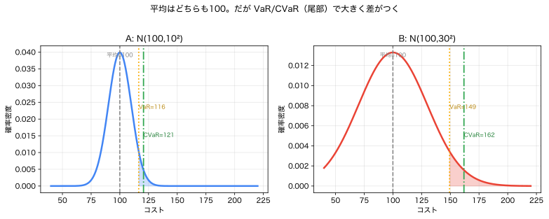

# Module 3 — 期待値・分散・共分散・相関

!!! abstract "30秒まとめ"
    - **何の話か**：期待値（平均）・分散（ばらつき）・共分散/相関（つながり）。
    - **分かること**：平均が同じでもリスクは違う。相関は合算した分散を増減させる。
    - **使う場面**：複数案のリスクの大小を比べる、複数の不確実量を合算するとき。

> **5つの問い**：①何が不確実か ②どの言語で表すか ③**何を良しとするか** ④式のどこに出るか ⑤代償は何か。
> この Module は **③「何を良しとするか」の数値化**——平均・ばらつき・尾部リスク——を扱います。

Module 2 で分布（地図全体）を手にしました。ここでは地図を**1つ／少数の数に要約**します。ただし「どの数で要約するか」で、見えるリスクが変わります。本 Module の背骨は——

> **平均が同じでも、リスクは違う。** だから平均だけでは意思決定できない。

これが Module 6 の「期待値最小化 vs CVaR最小化 vs ロバスト」の分岐点になります。

---

## 1. 現象・直感：平均が同じ、でも怖さが違う

2つの運用案 A・B があり、**平均コストはどちらも100**だとします。

- **案A**：だいたい 90〜110。たまに外れても 120 くらい。
- **案B**：普段は 80 くらいで安いが、**まれに 250 に跳ねる**。

平均はどちらも100。けれど、**大損の可能性**は B が圧倒的に大きい。
「平均100」という1つの数は、この差を**まったく映していません**。意思決定には平均の外側——**ばらつき**と**尾部**——を測る道具が要ります。

---

## 2. 期待値 E[X]

### 2.1 定義
$$
E[X] = \begin{cases}\displaystyle\sum_x x\,p_X(x) & (\text{離散})\\[2mm] \displaystyle\int_{-\infty}^{\infty} x\,f_X(x)\,dx & (\text{連続})\end{cases}
$$
> **意味**：起こりうる値を、**起こりやすさで重みづけした平均**。「多数回繰り返したときの平均値」。

期待値は「分布の重心」。第1ツールの密度曲線を厚紙で切り抜いたとき、釣り合う点です。

### 2.2 線形性（最強の道具）
$$
\boxed{\,E[aX + bY] = a\,E[X] + b\,E[Y]\,}\qquad(\text{$X,Y$ が独立でなくても成立}).
$$
> **意味**：期待値は和・定数倍を素通りする。**相関があっても**成り立つのが強力（分散はそうはいかない、後述）。

指示関数との橋（Module 1）：$E[\mathbb{1}_A] = P(A)$。確率は期待値の特別な場合。

### 2.3 イェンゼンの不等式（Module 0 の罠の正体）
$g$ が凸関数なら
$$
E[g(X)] \ge g(E[X]).
$$
> Module 0 の「平均で評価する罠」$E[\text{Cost}(q,D)] \ge \text{Cost}(q,E[D])$ はこれ。
> **平均を先に代入すると、凸なコストを過小評価する**。等号は $g$ が線形 or $X$ が定数のとき。

---

## 3. 分散と標準偏差：ばらつきの大きさ

### 3.1 定義
$$
\mathrm{Var}(X) = E\big[(X-E[X])^2\big] = E[X^2] - (E[X])^2, \qquad \sigma_X = \sqrt{\mathrm{Var}(X)}.
$$
> **意味**：平均からの**ずれの2乗の平均**。標準偏差 $\sigma_X$ は $X$ と同じ単位なので解釈しやすい。

### 3.2 分散が測るもの・測らないもの

| 測るもの | 測らないもの |
|---|---|
| 平均まわりの散らばりの**大きさ** | 散らばりの**向き（左右非対称）** |
| 上下を**対称に**ペナルティ | 「悪い側だけ」のリスク（尾部） |

> **限界**：分散は上振れと下振れを**同じ重さ**で測る。コストでは「上振れ（高コスト）だけ」が怖いのに、分散は安い側のばらつきも同罪にする。だから**尾部リスクには分位点・CVaR が要る**（§7）。

### 3.3 分散は線形性を持たない
$$
\mathrm{Var}(aX) = a^2\,\mathrm{Var}(X), \qquad
\mathrm{Var}(X+Y) = \mathrm{Var}(X) + \mathrm{Var}(Y) + 2\,\mathrm{Cov}(X,Y).
$$
> 和の分散には**共分散**が現れる。複数の不確実要因を合成するとき、**相関を無視できない**ことの数式的根拠（§5）。

---

## 4. 「平均が同じ、リスクが違う」を数で見る


*図：A: $\mathcal{N}(100,10^2)$ と B: $\mathcal{N}(100,30^2)$。平均はどちらも100だが、VaR$_{0.95}$・CVaR$_{0.95}$（尾部）で大きく差がつく（A:CVaR120.6 / B:161.9）。（再生成：`python scripts/03_mean_var_cvar.py`）*

§1 の案A・Bを正規分布で近似します（コスト分布、右が悪い）。

| 指標 | 案A $\mathcal{N}(100,10^2)$ | 案B $\mathcal{N}(100,30^2)$ | 何を見るか |
|---|---|---|---|
| 平均 $E$ | 100 | 100 | 中心（重心） |
| 標準偏差 $\sigma$ | 10 | 30 | ばらつきの大きさ |
| VaR$_{0.95}$ | 116.4 | 149.3 | 「上位5%に入る境界値」 |
| CVaR$_{0.95}$ | 120.6 | 161.9 | 「最悪5%の平均」＝尾部の深さ |

**平均は同一（100）なのに、CVaR$_{0.95}$ は 120.6 vs 161.9**。案Bの「まれな大損」は、平均には現れず、**尾部の指標で初めて見える**。

```
密度
 │     A（細い）          B（太い・裾が遠い）
 │      ╱▔╲                ╱▔▔▔╲
 │     ╱   ╲              ╱      ╲
 │    ╱     ╲           ╱         ╲____
 │__╱        ╲___    _╱              ╲▓▓▓___  ← B の尾部（CVaRが拾う）
 └─────┼────┼──────────┼─────┼──────────→ コスト
      E=100 VaR_A      E=100 VaR_B  CVaR_B
```

> **教訓**：要約する数を「平均→分散→VaR→CVaR」と変えると、**見えるリスクの解像度**が上がる。
> Module 6 で「何を最小化するか」を選ぶとは、**この要約量を選ぶこと**にほかなりません。

---

## 5. 共分散と相関：一緒に動くか

### 5.1 定義
$$
\mathrm{Cov}(X,Y) = E\big[(X-E[X])(Y-E[Y])\big], \qquad
\rho_{XY} = \frac{\mathrm{Cov}(X,Y)}{\sigma_X\,\sigma_Y} \in [-1,1].
$$
> **意味**：$X$ が平均より大のとき $Y$ も大なら正、逆なら負。相関 $\rho$ は単位をそろえた $[-1,1]$ の指標。

### 5.2 電力例：相関が「正味負荷」のリスクを変える

正味負荷（需要から再エネを引いた、火力等で賄う分）$L = D - P$（$D$=需要、$P$=PV出力）。
$$
\mathrm{Var}(L) = \mathrm{Var}(D) + \mathrm{Var}(P) - 2\,\mathrm{Cov}(D,P).
$$
$\sigma_D=10,\ \sigma_P=8$ として、相関 $\rho$ を変えると：

| $\rho_{DP}$ | $\mathrm{Cov}$ | $\mathrm{Var}(L)$ | $\sigma_L$ | 解釈 |
|---|---|---|---|---|
| $+0.5$ | $+40$ | 84 | **9.17** | 暑い晴天日に需要↑＆PV↑ → 正味は相殺、**変動小** |
| $0$ | 0 | 164 | 12.81 | 独立 |
| $-0.5$ | $-40$ | 244 | **15.62** | 逆相関なら正味の**変動大** |

> **核心**：$D$ と $P$ を「別々に（独立と仮定して）」扱うと $\sigma_L=12.8$ と評価するが、実際に正の相関があれば $9.17$。**相関を無視すると合成リスクを誤る**。系統運用では予備力の量がこの差で変わります。

---

## 6. 独立 ⇒ 無相関、しかし逆は偽（数値反例）

$$
\textbf{独立} \Rightarrow \mathrm{Cov}=0\ (\textbf{無相関}), \qquad \textbf{無相関} \not\Rightarrow \textbf{独立}.
$$

**反例**：$X \in \{-1,0,1\}$ 各確率 $1/3$、$Y = X^2$。
- $E[X] = 0$。$\mathrm{Cov}(X,Y) = E[XY]-E[X]E[Y] = E[X^3] - 0 = \frac{(-1)+0+1}{3} = 0$ → **無相関**。
- しかし $P(Y=1\mid X=0) = 0 \ne P(Y=1) = \frac{2}{3}$ → **従属**（$Y$ は $X$ で完全に決まる）。

> **教訓**：相関0は「**線形**の連動なし」を言うだけ。非線形依存は残る。
> 「需要とPVは無相関だから独立に扱う」は危険。猛暑×PV効率低下のような**非線形共変動**を見落とす（§5の相関すら捉えきれない、より強い依存がありうる）。

---

## 7. 条件付き期待値と全期待値の法則

### 7.1 条件付き期待値 E[X | Y]
「$Y$ を知ったうえでの $X$ の平均」。$Y$ の値ごとに $X$ の平均が決まるので、$E[X\mid Y]$ は**$Y$ の関数（＝確率変数）**。

### 7.2 全期待値の法則（タワー則）
$$
\boxed{\,E[X] = E\big[E[X\mid Y]\big]\,}.
$$
> **意味**：場合分け（$Y$）して各場合の平均を求め、$Y$ の確率で平均し直すと全体平均に戻る。

**例**：$Y=$「天候」。晴天（確率0.5）なら需要平均80、猛暑（0.5）なら120。
$$
E[\text{需要}] = 0.5\cdot 80 + 0.5\cdot 120 = 100.
$$
> シナリオ別の期待値を確率で束ねる——これは Module 5 のシナリオ法・二段階確率計画の計算そのものです。

---

## 8. VaR と CVaR：尾部リスクの言葉（Module 6 への橋）

コスト $C$（大きいほど悪い）に対し、信頼水準 $\alpha$（例 0.95）で：

- **VaR$_\alpha$（Value-at-Risk）**：$C$ の $\alpha$ 分位点。「$C$ が $\mathrm{VaR}_\alpha$ 以下に収まる確率が $\alpha$」。
$$ \mathrm{VaR}_\alpha(C) = \min\{t : P(C\le t)\ge \alpha\}. $$
- **CVaR$_\alpha$（Conditional VaR / 期待ショートフォール）**：「最悪 $(1-\alpha)$ の平均」。
$$ \mathrm{CVaR}_\alpha(C) = E\big[\,C \mid C \ge \mathrm{VaR}_\alpha(C)\,\big]\quad(\text{連続の場合}). $$

| 指標 | 見るもの | 弱点 / 強み |
|---|---|---|
| 平均 $E[C]$ | 中心 | 尾部に鈍感 |
| 分散 $\sigma$ | 散らばり | 上下対称、尾部の深さは見ない |
| VaR$_\alpha$ | 尾部の**境界** | その先の深さを見ない／**非凸**で最適化が難しい |
| CVaR$_\alpha$ | 尾部の**平均（深さ）** | VaR より保守的／**凸**で最適化しやすい（Rockafellar–Uryasev） |

> **なぜ CVaR が主役になるか**：① VaR が無視する「境界の先の大損」を平均として捉え、② 数学的に**凸**なので最適化に組み込める（Module 6）。
> いまは「平均は中心、CVaR は尾部の深さ」という直感で十分です。

---

## 9. Python による確認

```python
import numpy as np
from scipy import stats

# --- 平均同じ・リスク違い：VaR/CVaR（正規, 右尾, α=0.95）---
z = stats.norm.ppf(0.95)            # 1.6449
cvar_f = stats.norm.pdf(z) / 0.05   # 2.0627（正規のCVaR係数）
for sd in [10, 30]:
    print(f"N(100,{sd}^2): mean=100, VaR.95={100+z*sd:.1f}, CVaR.95={100+cvar_f*sd:.1f}")
# → A(sd10): VaR116.4 CVaR120.6 / B(sd30): VaR149.3 CVaR161.9（平均は同じ100）

# --- 相関と正味負荷 L=D-P ---
sD, sP = 10, 8
for rho in [0.5, 0.0, -0.5]:
    varL = sD**2 + sP**2 - 2*rho*sD*sP
    print(f"rho={rho:+.1f}: Var(L)={varL:.0f}, sd(L)={varL**0.5:.2f}")

# --- 独立≠無相関：X∈{-1,0,1}, Y=X^2 ---
xs = np.array([-1, 0, 1]); pr = np.ones(3)/3
EX = (xs*pr).sum(); EXY = (xs**3*pr).sum(); EY = (xs**2*pr).sum()
print("Cov(X,Y) =", EXY - EX*EY, " （無相関）  P(Y=1|X=0)=0 ≠ P(Y=1)=2/3 （従属）")

# --- CVaR をモンテカルロで実証（定義の確認）---
rng = np.random.default_rng(0)
s = rng.normal(100, 30, 2_000_000)
var95 = np.quantile(s, 0.95); cvar95 = s[s >= var95].mean()
print(f"MC: VaR.95={var95:.1f}, CVaR.95={cvar95:.1f}（解析値149.3/161.9と一致）")
```

**観察ポイント**
- 平均100は両案で同じ。違いは**CVaR で初めて**大きく出る（120.6 vs 161.9）。
- 相関 $\rho$ を変えると正味負荷の $\sigma$ が 9.17〜15.62 と動く。**相関は合成リスクを左右する**。
- $X,Y=X^2$ は Cov=0 でも従属。**無相関＝独立ではない**。

---

## 10. 電力・エネルギーへの接続

| 概念 | 電力での意味 | 後段 |
|---|---|---|
| 期待値 $E[\text{コスト}]$ | 平均運用費 | 期待値最小化（M6） |
| 分散・$\sigma$ | 運用費・出力の変動 | 予備力サイジング |
| 共分散・相関 | 需要×PV、地点間PVの連動 | 正味負荷リスク、ポートフォリオ |
| 条件付き期待値 | シナリオ別の期待費用 | 二段階確率計画（M5,6） |
| VaR | 95%ile の需要・損失 | 設計値・チャンス制約 |
| CVaR | 高価格・逼迫時の平均損失 | CVaR最小化（M6） |

> **設計の勘所**：「平均運用費が同じ2案」を比べるとき、**CVaR で順位が逆転**することがある。
> 何を最小化するか（平均か尾部か）は技術問題ではなく**価値判断**であり、それを数式（目的関数）に落とすのが Module 6 です。

---

## 11. 理解確認問題

> 解答：[`exercises/solutions/03_expectation_variance_covariance_solutions.md`](../exercises/solutions/03_expectation_variance_covariance_solutions.md)

### 初級
1. $X$ が $\{0,1,2\}$ を確率 $0.5,0.3,0.2$ でとる。$E[X]$ と $\mathrm{Var}(X)$ を求めよ。
2. 期待値の線形性を使い、$E[3X+2]$ を上の $X$ で求めよ。
3. 「平均が同じでもリスクが違う」を、§4 の A・B の CVaR の数値で説明せよ。

### 中級
4. $\sigma_D=10,\ \sigma_P=8$ で、相関 $\rho=0.5,0,-0.5$ のときの正味負荷 $L=D-P$ の標準偏差を求め、「需要とPVを独立と仮定する」誤差を述べよ。
5. $X\in\{-1,0,1\}$ 各 $1/3$、$Y=X^2$ で $\mathrm{Cov}(X,Y)=0$ を示し、にもかかわらず従属である理由を述べよ。
6. 天候 $Y$（晴0.5/猛暑0.5）で需要平均が 80/120 のとき、全期待値の法則で $E[\text{需要}]$ を求めよ。さらに各天候の分散が 25 のとき、$\mathrm{Var}(\text{需要})$ を全分散の公式で求めよ。

### 発展
7. VaR と CVaR の違いを、「境界 vs 平均」「凸性」「最適化のしやすさ」の3点で説明し、なぜ Module 6 で CVaR が好まれるか論ぜよ。
8. 平均コストが等しい2案で、片方は分散が小さいが稀に巨大損失（重い裾）、もう片方は分散が大きいが上限が有界とする。分散と CVaR で順位が食い違いうることを説明し、どちらの指標で意思決定すべきか、状況設定とともに論ぜよ。

---

## 12. よくある誤解

| 誤解 | 正しい理解 |
|---|---|
| 平均が同じならリスクも同じ | 分散・尾部（CVaR）が違えばリスクは違う。 |
| 分散が小さければ安全 | 分散は対称。稀な巨大損失（重い裾）は分散に出にくい→CVaR を見る。 |
| $\mathrm{Var}(X+Y)=\mathrm{Var}(X)+\mathrm{Var}(Y)$ | 相関があると $+2\mathrm{Cov}$ が付く。独立のときだけ和。 |
| 無相関なら独立 | 独立⇒無相関だが逆は偽（$Y=X^2$）。 |
| 期待値の線形性は独立が必要 | 不要。相関があっても $E[aX+bY]=aE[X]+bE[Y]$。 |
| VaR が分かれば尾部は十分 | VaR は境界のみ。その先の深さは CVaR。 |

---

## 13. まとめと次の一手

- 期待値は重心（線形性が強力、相関に強い）。イェンゼンが Module 0 の罠の正体。
- 分散はばらつきの大きさ（対称、尾部に鈍感）。**平均が同じでもリスクは違う**ので、VaR・CVaR で尾部を測る。
- 共分散・相関は**合成リスク**を左右する（正味負荷）。独立と無相関は別物。
- 条件付き期待値・全期待値の法則は、シナリオ計算（M5,6）の土台。

> **次へ**：これまで「分布は与えられた」としてきました。現実には分布は**データから推定**します。
> 観測データと真の分布の違い、経験分布・ヒストグラム・密度推定、そして時系列の落とし穴へ。
> → [04_from_data_to_distribution](04_from_data_to_distribution.md)

### この Module で「言えたら合格」
> 「平均が同じでも分散・CVaR が違えばリスクは違う。分散は対称で尾部に鈍感だから、大損を避けたいなら CVaR を見る。相関は合成リスクを変え、独立は無相関より強い。」
