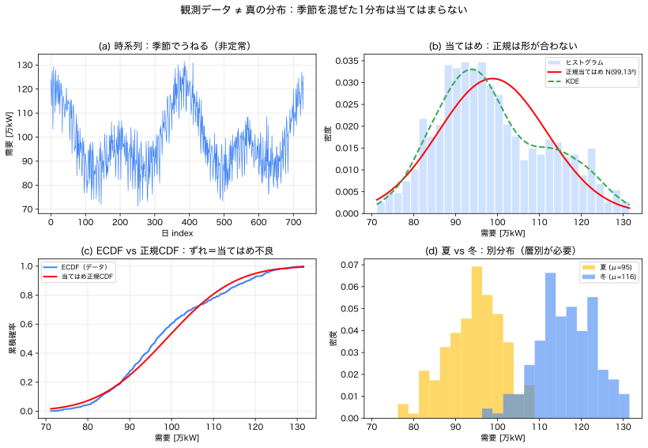

# Module 4 — データから分布へ

!!! abstract "30秒まとめ"
    - **何の話か**：観測データから分布を推定する（標本≠真の分布）。
    - **分かること**：推定値自体がばらつく。データが増えると不確かさ（誤差）は減る。
    - **使う場面**：手元データから分布やパラメータを作るとき。 → [▶ モンテカルロツール](../interactive/index.md) で標本のばらつきを見る。

> **5つの問い**：①何が不確実か ②どの言語で表すか ③何を良しとするか ④式のどこに出るか ⑤**代償（データ・仮定の限界）は何か**。
> この Module は **⑤の核心＝「分布はどこから来るのか／どこまで信じられるか」** を扱います。

Module 2–3 では「分布は与えられた」としてきました。けれど現実には、**真の分布を直接見ることはできません**。見えるのは**有限のデータ**だけ。本 Module の背骨は——

> **観測データは真の分布ではない。** データは真の分布から漏れ出た**有限の標本**にすぎない。

この区別（Module 0 の「認識論的不確実性」）が、Module 6 で「分布を信じる（期待値・CVaR）か、信じない（ロバスト）か」を決めます。

---

## 1. 現象・直感：真の分布は永遠に見えない

「明日の需要の分布」を知りたいとします。しかし手元にあるのは過去2年の**観測値730個**だけ。

- ヒストグラムを描けば**それらしい形**は見える。
- でもそれは730個の**たまたまの並び**。来年同じデータは取れない。
- ビンの幅を変えれば形も変わる。**データの要約方法**にも恣意性がある。

> **真の分布 $\mathbb{P}$** は背後にある理想。**データ $x_1,\dots,x_n$** はそこからの標本。
> 我々ができるのは、データから $\mathbb{P}$ を**推定**することだけ。推定には必ず**誤差（不確実性）**が伴う。

このノートでは合成データ（`data/daily_peak_demand.csv`, `data/pv_daily_factor.csv`）を使います。**真の生成過程が既知**なので、推定が当たっているか答え合わせできます。

---

## 2. 標本と母集団、観測と真の分布

| 言葉 | 意味 | 記号 |
|---|---|---|
| 母集団／真の分布 | 背後の理想的な分布（無限母集団） | $\mathbb{P},\ f_X$ |
| 標本 | 実際に観測された有限個 | $x_1,\dots,x_n$ |
| 母数（パラメータ） | 真の分布の特性値 | $\mu,\ \sigma^2$ |
| 統計量（推定量） | データから計算した値 | $\bar{x},\ s^2$ |

> **統計量は母数の推定であって、母数そのものではない。** $\bar{x}\approx\mu$ だが等しくない。

---

## 3. 標本平均・標本分散と「推定値の不確実性」

$$
\bar{x} = \frac{1}{n}\sum_{i=1}^n x_i, \qquad
s^2 = \frac{1}{n-1}\sum_{i=1}^n (x_i-\bar{x})^2.
$$
> $s^2$ の分母が **$n-1$**（ベッセル補正）なのは、$\bar{x}$ を使った分だけ自由度が1減り、$n$ で割ると分散を**過小評価**するから。$n-1$ で割ると不偏推定になる。

### 推定値そのものがばらつく：標準誤差
標本平均 $\bar{x}$ は確率変数（別のデータなら別の値）。そのばらつきは
$$
\mathrm{SE}(\bar{x}) = \frac{\sigma}{\sqrt{n}}.
$$
> **意味**：データを増やす（$n\uparrow$）と推定は精緻化するが、精度は $\sqrt{n}$ でしか上がらない。
> 4倍のデータで誤差は半分。**「平均を1つ出した」ことと「真の平均を知った」ことは違う**。これが認識論的不確実性の正体。

サンプルデータ（需要）：$n=730,\ \bar{x}=98.8,\ s=12.9$。
標準誤差 $\mathrm{SE}=12.9/\sqrt{730}\approx 0.48$。つまり真の平均は **おおよそ $98.8\pm1.0$** 程度の幅でしか分からない。

---

## 4. 分布を「形」として推定する3つの道具

### 4.1 ヒストグラム（最も素朴）
データを区間（ビン）に分け、頻度を棒で。面積1に正規化すると PDF の**粗い推定**。
- 長所：直感的。短所：**ビン幅に敏感**（広いと潰れ、狭いとガタガタ）。同じデータでも見え方が変わる。

### 4.2 経験分布 ECDF（最も正直）
$$
\hat{F}_n(x) = \frac{1}{n}\sum_{i=1}^n \mathbb{1}[x_i \le x].
$$
> 「$x$ 以下のデータの割合」。階段関数。**ビン幅の恣意性がない**。
> **グリヴェンコ–カンテリの定理**：$n\to\infty$ で $\hat{F}_n \to F$（真のCDF）に一様収束。
> ECDF は真のCDFの**素直な推定**で、Module 5 の経験分布サンプリングの土台。

### 4.3 カーネル密度推定 KDE（なめらかな推定）
各データ点に小さな山（カーネル）を置いて足し合わせ、なめらかな密度を作る。
- 長所：ヒストグラムより滑らか。短所：**バンド幅**（山の広さ）に敏感（ビン幅問題の親戚）。

### 4.4 パラメトリック当てはめ（分布族を仮定）
「正規だ」と**仮定**し、$\mu,\sigma$ をデータから推定（最尤法など）。
- 長所：少ないパラメータで表現、外挿しやすい。短所：**仮定が外れると致命的**（裾を見誤る）。
- 仮定の妥当性は**適合度検定**（QQプロット、KS検定）で確認する。

> **使い分け**：分布の形を信じられる→パラメトリック。信じられない／裾が大事→ECDF・KDE（ノンパラ）。
> これは Module 6 の「分布を信じる最適化 vs ロバスト最適化」の判断と**同じ構造**。

---

## 5. iid 仮定の限界：時系列は「同じ分布の独立な並び」ではない


*図 (a) 時系列は季節でうねる（非定常）。(b) 正規当てはめは形が合わない。(c) ECDF と当てはめ正規CDF のずれ。(d) 夏 vs 冬は別分布（層別が必要）。（再生成：`python scripts/04_data_to_distribution.py`）*

Module 2–3 の多くは **iid（独立同分布）** を暗黙に仮定しています。しかし実データは違う。

サンプル需要データで確認（`gen_sample_data.py` の出力）：
- **季節性（非定常）**：夏平均 94.6 vs 冬平均 116.3（**差21.7**）。暖房主導の冬ピーク型。
  → 全730日を**1つの分布**で扱うと、夏と冬を混ぜた「二こぶ」になり、どの季節も正しく表せない。
- **曜日効果**：週末は約8低い。曜日で分布が違う。
- **トレンド**：2年で緩やかに増加。平均が時間とともに動く＝**非定常**。
- **自己相関**：今日が高ければ明日も高い傾向。**独立でない**。

```
需要（時間順）  ～季節で平均がうねる（非定常）～
116│      冬         冬          ← 全期間を1分布にすると
   │    ╱╲╲       ╱╲╲              夏と冬が混ざって二こぶ
100│  ╱     ╲╱╲ ╱     ╲╱╲
 95│ ╱   夏    ╲     夏   ╲
   └──────────────────────→ 日
```

> **教訓**：「データに分布を当てはめる」前に、**iid とみなせる単位に切る**（季節・曜日・時間帯で層別）。
> 混ぜたまま1分布を当てると、**平均は合っても分布の形・裾を誤る**。これは予測誤差モデルや最適化の前提を壊す。

### 外れ値
記録ミス・特異日（猛暑記録、設備事故）が混じると、平均・分散・裾推定が歪む。**外れ値は「除く」前に「なぜ出たか」を問う**（本物の極端事象なら、むしろ尾部リスクの重要情報）。

---

## 6. 予測誤差の分布：不確実性モデルの出発点

実務で確率分布を当てるのは、生の量より**予測誤差**であることが多い：
$$
\text{誤差} = \text{観測値} - \text{予測値}.
$$
- 点予測（決定論モデルの入力）に、誤差分布を足して**確率的な予測**にする。
- 誤差は「平均0・対称」とは限らない（PVは下振れに偏るなど）。
- この誤差分布が、Module 5 のシナリオ生成、Module 6 のチャンス制約・CVaR の**入力**になる。

> Module 0 の「予測値（点）→ 確率分布」への格上げが、ここで具体化します。
> **予測誤差の分布をデータから推定する**——それが「不確実性をモデル化する」の実体。

---

## 7. 「どの分布を仮定すべきか」チェックリスト

データを前に、次を順に問う。

1. **対象は何か？** 連続か離散か。非負か（需要・価格は≥0）。有界か（利用率は0–1）。
2. **iid とみなせる単位に切ったか？** 季節・曜日・時間帯・地点で層別したか。
3. **裾は重いか？** 極端値の頻度を ECDF の右端で確認。重いなら正規は不可（対数正規・一般化パレート等）。
4. **歪んでいるか？** ヒストグラム/中央値と平均の差。右歪みなら対数正規・ガンマ。
5. **形を信じられるか？**
   - 信じられる＆少データ → パラメトリック当てはめ（適合度検定で確認）。
   - 信じられない／裾が命 → ECDF・KDE（ノンパラ）、または分布族（ロバスト）。
6. **当てはめたら検証したか？** QQプロット・KS検定・残差。**当てはめっぱなしにしない**。
7. **外挿の範囲は？** データの外（観測史上最大を超える需要）は、どの方法でも**仮定**。慎重に。

> 迷ったら：**まず ECDF（正直）→ 形が素直ならパラメトリック、裾が怪しければノンパラ／ロバスト**。

---

## 8. Python による確認

```python
import numpy as np
import pandas as pd
from scipy import stats

df = pd.read_csv("data/daily_peak_demand.csv")
x = df["demand_mw10k"].values

# 標本統計と標準誤差
xbar, s, n = x.mean(), x.std(ddof=1), len(x)
print(f"mean={xbar:.2f}, s={s:.2f}, SE(mean)={s/np.sqrt(n):.3f}")   # 98.80, 12.91, 0.48

# パラメトリック当てはめ（正規）と適合度（KS）
mu, sd = stats.norm.fit(x)
ks = stats.kstest(x, "norm", args=(mu, sd))
print(f"fit N({mu:.1f},{sd:.1f}), KS p-value={ks.pvalue:.4f}")  # 季節混在で当てはまりは悪い

# iid を壊す季節性：夏 vs 冬
t = df["day_index"].values % 365
summer = x[(t >= 152) & (t <= 243)]
winter = x[(t <= 59) | (t >= 335)]
print(f"夏 mean={summer.mean():.1f}, 冬 mean={winter.mean():.1f}（差で非定常を確認）")

# ECDF（真のCDFの素直な推定）
xs = np.sort(x); ecdf = np.arange(1, n+1)/n
print("ECDF: P(需要<=110) ≈", round(ecdf[np.searchsorted(xs, 110)], 3))
```

**観察ポイント**
- 標準誤差 0.48：**730日あっても真の平均は ±1 程度しか分からない**。
- 正規当てはめの KS は悪い：**季節を混ぜた1分布は当てはまらない** → 層別が必要。
- 夏94.6/冬116.3：**非定常**。「データに1分布」を疑う根拠。

---

## 9. 電力・エネルギーへの接続

| データ | 落とし穴 | 対処 |
|---|---|---|
| 負荷（需要） | 季節・曜日・気温依存（非定常） | 層別、気温で条件付け |
| PV・風力出力 | 非負・有界・天候で右/左歪み、夜間ゼロ | 時間帯別、Beta/混合分布 |
| 価格 | 重い裾・スパイク・負価格 | 裾を別扱い、対数/極値分布 |
| 予測誤差 | 自己相関・予報更新で変化 | リード時間別に誤差分布 |
| 故障間隔 | 摩耗で非定常（記憶あり） | ワイブル等、指数を疑う |

> **設計の勘所**：「過去データ＝未来の分布」と素朴に置くと、**非定常**（気候変動・需要構造変化）で外れる。
> データから作った分布は**いつの・どの条件の分布か**を常に問う。これが Module 6 で「分布を信じるか（期待値）／集合で守るか（ロバスト）」の判断に直結。

---

## 10. 理解確認問題

> 解答：[`exercises/solutions/04_from_data_to_distribution_solutions.md`](../exercises/solutions/04_from_data_to_distribution_solutions.md)

### 初級
1. 「標本平均 $\bar{x}$」と「真の平均 $\mu$」の違いを1文で。なぜ等しくないか。
2. 標準誤差 $\sigma/\sqrt{n}$ の式から、推定誤差を半分にするには $n$ を何倍にすべきか。
3. ECDF とは何か。ヒストグラムに対する利点を1つ挙げよ。

### 中級
4. サンプル需要に正規分布を当てはめると適合度が悪い。理由を「季節性・非定常」で説明し、改善策を述べよ。
5. なぜ標本分散は $n-1$ で割るのか（直感で）。$n$ で割るとどちらに偏るか。
6. PV出力データに正規分布を当てはめる危険を2つ挙げよ（値域・歪みの観点）。

### 発展
7. 「過去2年のデータで作った需要分布」を来年の運用にそのまま使うことの危険を、非定常・標本誤差・外挿の3点で論ぜよ。
8. 予測誤差の分布を「リード時間別・季節別」に分けて推定すべき理由を、iid 仮定とチャンス制約（M6）への影響から説明せよ。

---

## 11. よくある誤解

| 誤解 | 正しい理解 |
|---|---|
| ヒストグラム＝真の分布 | 有限データの粗い推定。ビン幅で形が変わる。 |
| データが多ければ真の分布が分かる | 精度は $\sqrt{n}$ でしか上がらず、非定常なら多くても外れる。 |
| 標本平均＝真の平均 | 推定値。標準誤差の幅がある。 |
| 時系列データは iid | 季節・トレンド・自己相関で iid でない。層別が要る。 |
| 外れ値は消すもの | まず「なぜ出たか」。本物の極端事象は尾部リスクの宝。 |
| 正規を当てればよい | 非負・有界・重い裾のデータには不適。ECDF で形を確認。 |

---

## 章末セルフチェック

自分で答えてから開いてください。

??? question "Q1. 観測データは「真の分布」そのもの？"
    違う。データは真の分布から漏れ出た**有限の標本**。$\hat\mu,\hat\sigma$ 等の**推定値自体がばらつく**（標本が増えると縮む）。

??? question "Q2. 偶然的（aleatory）と認識論的（epistemic）不確実性の違いは？"
    偶然的＝本質的な**ばらつき**（情報でも減らない）。認識論的＝**知らないこと・誤差**（情報が増えると減る）。

## 12. まとめと次の一手

- **観測データ ≠ 真の分布**。データは有限標本、推定には標準誤差という不確実性が伴う。
- ヒストグラム・ECDF・KDE・パラメトリックを使い分け、**まず ECDF で正直に**形を見る。
- 時系列は iid でない（季節・トレンド・自己相関）。**iid 単位に層別**してから分布を当てる。
- 予測誤差の分布が、シナリオ・最適化の入力になる。

> **次へ**：推定した分布を、計算可能な**有限シナリオ**に落とし、モンテカルロで期待値やリスクを近似します。
> 「シナリオは分布を捨てているのか、近似しているのか」——ここを誤解したまま最適化に進むと危険です。
> → [05_scenarios_and_monte_carlo](05_scenarios_and_monte_carlo.md)

### この Module で「言えたら合格」
> 「観測データは真の分布そのものではなく有限標本。推定には標準誤差が伴い、時系列は iid でないので季節・曜日で層別してから分布を当てる。まず ECDF で正直に形を見る。」
