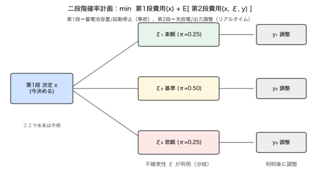

# Module 5 — シナリオとモンテカルロ法

!!! abstract "30秒まとめ"
    - **何の話か**：乱数で積分・期待値を近似する（モンテカルロ）と、最適化のSAA。
    - **分かること**：誤差は 1/√N で縮む。希少事象（尾）の評価は遅い。
    - **使う場面**：分布はあるが解析的に解けない／シナリオで最適化するとき。 → [▶ モンテカルロツール](../interactive/index.md) で収束を見る。

> **5つの問い**：①何が不確実か ②**どの言語で表すか（→有限シナリオ）** ③何を良しとするか ④式のどこに出るか ⑤代償は何か。
> この Module は **②の4番目の言語＝「有限シナリオ」** と、それを使う計算（モンテカルロ・SAA）を扱います。

分布（Module 2–4）は連続で、積分も期待値も**解析的に解けるとは限りません**。そこで分布を**有限個の代表点＋確率**に落とし、和で近似します。本 Module の背骨は——

> **シナリオは分布を「捨てている」のではない。計算可能にするための「離散近似」である。**

この一点を誤解すると、「シナリオ法＝大雑把な手抜き」と誤り、Module 6 のシナリオベース確率計画を正しく使えません。

---

## 1. 現象・直感：積分が解けないとき、どうするか

Module 0 の容量問題を、需要が**連続分布** $D\sim\mathcal{N}(100,15^2)$ の場合で解きたいとします。
期待コスト
$$
E[\text{Cost}(q,D)] = \int_{-\infty}^{\infty} \text{Cost}(q,d)\,f_D(d)\,dd
$$
を $q$ について最小化したい。だが Cost は折れ線、$f_D$ は正規——手で積分するのは面倒です。

**2つの近似戦略**：
1. **決定論化**：$D$ を平均100に固定 → Module 0 の「平均の罠」に落ちる。✗
2. **離散化（シナリオ）**：$D$ から $S$ 個サンプル $d_1,\dots,d_S$ を引き、平均で近似：
$$
E[\text{Cost}(q,D)] \approx \frac{1}{S}\sum_{s=1}^S \text{Cost}(q,d_s).
$$
これが**モンテカルロ／サンプル平均近似(SAA)**。分布の情報を**サンプルとして保ったまま**、和で計算します。

---

## 2. シナリオとは何か

**シナリオ** $\xi_s$ ＝ 不確実パラメータ $\xi$ が取りうる**1つの具体的な実現**。
**確率付きシナリオ** ＝ 各シナリオに重み $\pi_s\ge0$（$\sum_s\pi_s=1$）。

$$
\{(\xi_s, \pi_s)\}_{s=1}^S \quad\text{で分布 }\mathbb{P}\text{ を近似する}.
$$

- **等確率サンプリング**：分布から $S$ 個引き、$\pi_s=1/S$（モンテカルロ）。
- **確率付き離散点**：少数の代表点に確率を割り当てる（例：楽観/基準/悲観の3シナリオ）。

> **核心**：シナリオ集合は分布の**離散近似**。$S$ を増やせば真の分布に近づく。
> 「分布を捨てた」のではなく「分布を有限の粒に砕いた」。砕き方（サンプリング）が荒いと尾部を取りこぼす（§5）。

期待値・確率・CVaR は、すべて**シナリオ上の和**で書けます：
$$
E[C(x,\xi)] \approx \sum_s \pi_s\,C(x,\xi_s),\qquad
P(g(x,\xi)\le0) \approx \sum_s \pi_s\,\mathbb{1}[g(x,\xi_s)\le0].
$$
> これが Module 6 で「連続の確率最適化」を「有限個のシナリオ上の最適化（LP/MILP）」に変える仕掛けです。

---

## 3. モンテカルロ推定と収束


*図（左）$E[X]$ の逐次推定は真値100へ、CI は $1/\sqrt N$ で細る。（右）希少事象 $P(X>145)=0.00135$ は小Nで不安定（0ヒットも）。（再生成：`python scripts/05_monte_carlo.py`）*

期待値 $\theta=E[h(\xi)]$ を $N$ サンプルの平均 $\hat\theta_N=\frac1N\sum h(\xi_i)$ で推定する。

- **不偏性**：$E[\hat\theta_N]=\theta$（平均的には当たる）。
- **収束**：大数の法則で $\hat\theta_N\to\theta$。誤差のばらつきは
$$
\mathrm{SE}(\hat\theta_N) = \frac{\sigma_h}{\sqrt{N}} \quad(\sigma_h=\mathrm{std}(h(\xi))).
$$
> **$1/\sqrt{N}$ の壁**：精度を10倍にするにはサンプルを**100倍**。誤差は遅くしか減らない。

### 数値例：E[X]（X ~ N(100, 15²)、真値100）

| $N$ | 推定値 | 95%CI半幅 $1.96\sigma/\sqrt N$ |
|---|---|---|
| 10 | 94.97 | 9.30 |
| 100 | 99.25 | 2.94 |
| 1,000 | 99.57 | 0.93 |
| 10,000 | 99.85 | 0.29 |
| 100,000 | 99.94 | 0.09 |

推定は真値100へ。CI幅は $1/\sqrt N$ で縮む（$N$ ×100 で幅 ÷10）。

> **誤差を述べずに点推定だけ出すのは危険**。モンテカルロ結果には必ず**CI（不確かさ）**を添える。

---

## 4. サンプル平均近似（SAA）：最適化の前段

期待値最小化 $\min_x E[C(x,\xi)]$ を、サンプルで置き換える：
$$
\min_x\ \frac{1}{N}\sum_{i=1}^N C(x,\xi_i).
$$
> **SAA**：真の期待値最適化を、サンプル上の最適化に置換。$N\to\infty$ で最適値・最適解が真の問題に収束（一定条件下）。

### 数値例：容量問題（D ~ N(100, 15²), 不足10/過剰1）
真の最適は臨界比の分位点：$q^\*=F_D^{-1}(10/11)=F_D^{-1}(0.909)=120.03$（**Module 0 の2点版 $q^\*=120$ の連続版！**）。

| $N$（シナリオ数） | SAA の $\hat q$ | 真値120.03との差 |
|---|---|---|
| 20 | 123.70 | +3.67 |
| 100 | 118.50 | −1.53 |
| 1,000 | 118.80 | −1.23 |
| 10,000 | 120.10 | +0.07 |

> シナリオが少ないと最適解がぶれる。**「シナリオ数」は精度とコストのトレードオフ**。
> Module 0 で「平均で最適化すると120ではなく100を選ぶ罠」を見た。SAA は**サンプルを通じて分布の非対称性を正しく拾い**、$q\approx120$ に到達します。

---

## 5. 希少事象の難しさ：平均は見えても尾は見えない

希少だが重大な事象（大規模停電、価格スパイク）の確率 $p$ を MC で推定するのは**難しい**。

### 数値例：P(X>145)（X ~ N(100, 15²)、=P(Z>3)=0.00135）

| $N$ | ヒット数 | 推定値 | 相対誤差 |
|---|---|---|---|
| 1,000 | **0** | 0.000000 | 推定不能 |
| 10,000 | 14 | 0.001400 | 3.7% |
| 100,000 | 142 | 0.001420 | 5.2% |
| 1,000,000 | 1,315 | 0.001315 | 2.6% |

> **$N=1000$ では1回も起きず、確率0と誤推定**。希少事象は「サンプルに現れないと存在しないことにされる」。
> 確率 $p$ の事象を安定推定するには、**おおむね $\gtrsim 1/p \times($数十$)$** のサンプルが要る（$p=0.00135$ なら数万〜）。

**対策の考え方**：
- **重点サンプリング（importance sampling）**：尾部を多めに引いて重みで補正。
- **層別・条件付け**：希少事象が起きやすい条件（猛暑・寒波）を別に十分サンプル。
- **極値理論**：尾を分布で外挿（一般化パレート等）。

> **平均だけを見る危険**：MC で平均は早く収束するが、**尾部（CVaR・違反確率）は遅い／見えない**。
> 「平均運用費は推定できたが、稀な大停電確率は実は推定できていない」——これが Module 6 のチャンス制約・CVaR をサンプルで解くときの落とし穴。

---

## 6. シナリオ削減：多すぎるシナリオを賢く間引く


*図：二段階確率計画の木。第1段で決め（$x$）、不確実性 $\xi$ が分岐し、各シナリオで第2段リコース $y$ で調整。（再生成：`python scripts/05_scenario_tree.py`）*

最適化はシナリオ数に比例して重くなる。そこで、**分布をよく代表する少数シナリオ**に減らす：
- 近いシナリオをまとめ、確率を統合（クラスタリング、確率距離 Wasserstein 最小化）。
- 目的：**シナリオ数↓（計算↓）× 近似精度の劣化↓** のバランス。

> ただし**安易な削減は尾部を消す**。平均的なシナリオに寄せると、稀な悪シナリオ（運用上は最重要）が落ちやすい。削減後も**最悪系シナリオを保持**するのが定石。

```
シナリオ木（二段階）：第1段で決め、ξが分かってから第2段でリコース
              ┌─ ξ1 (π1) ─ 第2段決定 y1
  第1段決定 x ┼─ ξ2 (π2) ─ 第2段決定 y2     min E[第1段費用 + 第2段費用]
   (今決める) └─ ξ3 (π3) ─ 第2段決定 y3
```

> この「木」が Module 6 の**二段階確率計画**そのもの。第1段＝今の決定（蓄電池容量・起動停止）、第2段＝不確実性が判明した後の調整（充放電・出力調整）。

---

## 7. Python による確認

```python
import numpy as np
from scipy import stats

rng = np.random.default_rng(42)

# --- MC収束：E[X], X~N(100,15) ---
big = rng.normal(100, 15, 1_000_000)
for n in [10, 100, 1000, 10000, 100000]:
    est = big[:n].mean(); ci = 1.96*15/np.sqrt(n)
    print(f"N={n:6d}: est={est:.3f} ±{ci:.3f}")

# --- 希少事象 P(X>145)=0.00135 ---
for n in [1000, 10000, 100000, 1000000]:
    s = rng.normal(100, 15, n)
    print(f"N={n:7d}: hits={int((s>145).sum())}, est={ (s>145).mean():.6f}")

# --- SAA：容量問題（真の最適 q*=120.03）---
cs, co = 10.0, 1.0
cost = lambda q, d: cs*np.maximum(d-q,0) + co*np.maximum(q-d,0)
qs = np.linspace(80, 140, 601)
for n in [20, 100, 1000, 10000]:
    s = rng.normal(100, 15, n)
    ec = [cost(q, s).mean() for q in qs]
    print(f"N={n:5d}: SAA q_hat = {qs[int(np.argmin(ec))]:.2f}")
```

**観察ポイント**
- 平均は速く収束（CI が $1/\sqrt N$）。だが **$N=1000$ で希少事象は0ヒット＝見えない**。
- SAA の $\hat q$ は $N$ とともに真値120へ。シナリオが分布の非対称性を運ぶ。
- 乱数シードを変えると小サンプルの結果がぶれる＝**有限シナリオの不確実性**。

---

## 8. 電力・エネルギーへの接続

| 概念 | 電力での意味 |
|---|---|
| 確率付きシナリオ | 翌日の需要・PV・価格の代表パターン＋確率 |
| モンテカルロ | 多数の気象・需要シナリオで運用費・信頼度を評価 |
| SAA | シナリオベース確率計画（UC・経済負荷配分）の解法 |
| 希少事象 | 大規模停電・N-k 故障・価格スパイクの確率 |
| シナリオ削減 | 数千シナリオを数十に圧縮して最適化を可能にする |
| 二段階木 | 第1段：起動停止/容量、第2段：リアルタイム調整 |

> **設計の勘所**：シナリオ生成は **Module 4（データ→分布）の質**に依存する。
> 非定常を無視したサンプラは「平均的な日」ばかり生成し、**運用を脅かす稀な日を欠く**。
> 「何をサンプルするか」は「何を守りたいか」（尾部リスク）から逆算する。

---

## 9. 理解確認問題

> 解答：[`exercises/solutions/05_scenarios_and_monte_carlo_solutions.md`](../exercises/solutions/05_scenarios_and_monte_carlo_solutions.md)

### 初級
1. 「シナリオは分布を捨てている」は誤り。正しくは何か、1文で。
2. モンテカルロ推定の誤差は $N$ をどう増やすと半分になるか。
3. 確率付きシナリオ $\{(\xi_s,\pi_s)\}$ で期待値 $E[C(x,\xi)]$ はどう書けるか。

### 中級
4. $P(X>145)=0.00135$ を MC で推定するとき、$N=1000$ で何が起きるか（§5）。安定推定に必要なサンプル規模の目安と理由を述べよ。
5. SAA でシナリオ数を 20→10,000 と増やすと容量問題の $\hat q$ はどう動くか（§4）。なぜ収束するのか。
6. モンテカルロ結果に CI を必ず添えるべき理由を、点推定だけ報告する危険とともに述べよ。

### 発展
7. シナリオ削減で「平均的なシナリオに寄せる」と何が失われるか。電力運用での帰結（予備力・信頼度）とともに論ぜよ。
8. 二段階確率計画の木（§6）で、第1段と第2段が電力運用の何に対応するか具体化し、なぜ「今すべてを決めない」ことに価値があるか説明せよ。

---

## 10. よくある誤解

| 誤解 | 正しい理解 |
|---|---|
| シナリオ法は分布を諦めた手抜き | 分布の離散近似。$S$↑で真の分布に近づく。 |
| サンプルが多ければ何でも分かる | 平均は速いが希少事象は $1/p$ 規模の $N$ が要る。 |
| MC の点推定だけ見ればよい | CI（$1/\sqrt N$）を添えないと信頼性不明。 |
| 平均的シナリオを集めれば十分 | 稀な悪シナリオこそ運用の要。尾部を欠くと危険。 |
| シナリオ削減は常に安全 | 安易な削減は尾部を消す。最悪系を保持する。 |

---

## 章末セルフチェック

自分で答えてから開いてください（[▶ モンテカルロツール](../interactive/index.md)で収束を見る）。

??? question "Q1. モンテカルロ推定の誤差は、標本数 N でどう縮む？"
    標準誤差は $\sigma/\sqrt N$、すなわち **$1/\sqrt N$**。精度2倍に標本4倍。**希少事象（尾）は特に遅い**。

??? question "Q2. シナリオ法は分布を「捨てて」いる？"
    いいえ。分布を**有限の代表点＋確率に離散近似**しているだけ（SAA）。手抜きではなく、積分を計算可能にする手段。

## 11. まとめと次の一手

- シナリオは分布の**離散近似**。期待値・確率・CVaR はシナリオ上の**和**で書ける。
- モンテカルロ／SAA の誤差は $1/\sqrt N$。**平均は速く、尾は遅い／見えない**。
- 希少事象は $\sim1/p$ 規模のサンプルが要る。シナリオ生成は「守りたい尾部」から逆算。
- 二段階の木が Module 6 の確率計画の骨格。

> **次へ**：ついに**不確実性下の最適化**。決定論・期待値最小化・ロバスト・分布ロバスト・チャンス制約・CVaR を、**同じ1つの問題**で比較し、「なぜこの形式を選ぶか」を言語化します。これが本教材の到達点。
> → [06_optimization_under_uncertainty](06_optimization_under_uncertainty.md)

### この Module で「言えたら合格」
> 「シナリオは分布の離散近似で、期待値も確率もシナリオ上の和。MC誤差は $1/\sqrt N$ で平均は速いが希少事象は見えにくく、$\sim1/p$ のサンプルが要る。だからシナリオは守りたい尾部から逆算して作る。」
