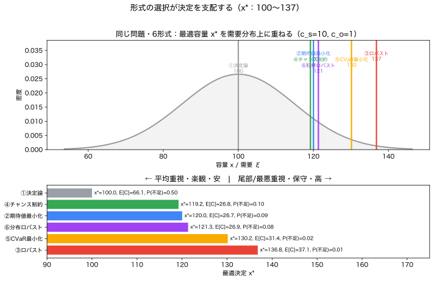

# Module 6 — 不確実性下の最適化（6形式）

!!! abstract "30秒まとめ"
    - **何の話か**：同じ問題を6形式（決定論／期待値／ロバスト／チャンス制約／CVaR／分布ロバスト）で解く。
    - **分かること**：「何を大事にするか」で最適決定が 100〜137 と変わる。技術でなく価値判断。
    - **使う場面**：不確実下で「どの基準で決めるか」を選ぶとき。 → [▶ 6形式コンパレータ](../interactive/index.md) で6つを並べて比べる。

> **5つの問い**（この Module で全部に答える）：①何が不確実か ②どの言語で表すか ③何を良しとするか ④式のどこに出るか ⑤代償は何か。

本教材の**到達点**です。Module 0–5 で積み上げた確率の言語を使い、**同じ1つの意思決定問題**を6つの形式で定式化し、**なぜこの形式を選ぶのか**を自分の言葉で言えるようにします。

> **核心**：6形式は別々の難しい手法ではない。**「不確実性をどう表すか × 何を最適化するか」の組み合わせ**にすぎない（[optimization_map](../roadmap/optimization_map.md) の二軸マップ）。

---

## 1. 統一問題：容量調達（reserve / newsvendor）

明日の需要 $\xi$（=$D$）に備え、容量 $x$（=$q$）を**前もって**確保する（Module 0 の問題の連続版）。
$$
C(x,\xi) = \underbrace{c_s\,\max(\xi-x,0)}_{\text{不足}} + \underbrace{c_o\,\max(x-\xi,0)}_{\text{過剰}},\qquad c_s=10,\ c_o=1.
$$
不確実性 $\xi\sim\mathcal{N}(100,15^2)$（必要に応じてデータ・シナリオ・集合で表す）。
**不足が過剰の10倍痛い**——この非対称性が、形式ごとに違う $x$ を生みます。

各形式の最適 $x^\*$ は、後で cvxpy / 解析で求めると次のようになります（§8 で検証）。**先に結論の地図**を持っておきましょう。

| 形式 | 最適 $x^\*$ | ひと言 |
|---|---|---|
| 決定論的 | 100.0 | 平均で計画（非対称を無視、過小） |
| チャンス制約 ($\varepsilon=0.1$) | 119.2 | 9割の日は不足させない |
| 期待値最小化 | 120.0 | 平均費用を最小（臨界分位点） |
| 分布ロバスト (Scarf) | 121.4 | 平均・分散だけ信じ最悪分布に備える |
| CVaR ($\alpha=0.9$) | 130.2 | 最悪1割の平均費用を抑える |
| ロバスト ($[55,145]$) | 136.8 | 区間内の最悪需要に必ず備える |

> 決定論の100からロバストの137まで、**同じ問題で決定が37%も違う**。違いは「何を不確実とし、何を守るか」だけ。以下、1つずつ。

---

## 2. 形式①：決定論的最適化

$$
\min_x\ C(x,\hat\xi)\quad\text{s.t. 制約},\qquad \hat\xi = E[\xi]=100.
$$
- **不確実性 $\xi$**：無視（代表値1点に固定）。
- **表現**：点推定。 **目的**：1シナリオのコスト。
- **結果**：$x^\*=100$。Module 0 で見た通り、**非対称コストを取りこぼし過小**。実際の期待費用は最適より大幅に悪い。

??? note "導出（決定論の最適点）"
    不確実性を1点 $\hat\xi=\mu$ に固定すると $C(x,\mu)=c_s\max(\mu-x,0)+c_o\max(x-\mu,0)$。これは $x=\mu$ で $0$、両側で線形に増える凸関数だから最小は $x^\*=\mu=100$。**ばらつきを捨てたぶん実分布では過小**（形式②が与える $F^{-1}(c_s/(c_s+c_o))>\mu$ と対照）。

- **いつ妥当**：ばらつきが小さい／結果が対称なとき（Module 0 の「壊れない条件」）。
- **代償**：データ最小・高速だが、不確実性が大きいと脆い。

---

## 3. 形式②：期待値最小化（と二段階確率計画）

$$
\min_x\ E[C(x,\xi)]\ \approx\ \min_x\ \frac1S\sum_{s=1}^S C(x,\xi_s)\quad(\text{SAA, Module 5}).
$$
- **不確実性 $\xi$**：確率変数（分布 $\mathbb{P}$）。 **表現**：分布／シナリオ。
- **目的**：**平均**コスト。 **制約**：平均的に／各シナリオで。
- **結果**：$x^\*=F_\xi^{-1}\!\big(\tfrac{c_s}{c_s+c_o}\big)=F_\xi^{-1}(0.909)=120.0$（臨界分位点）。

??? note "導出（臨界比＝newsvendor の最適性条件）"
    期待コスト $g(x)=E[C(x,\xi)]=c_s\,E[(\xi-x)^+]+c_o\,E[(x-\xi)^+]$ を $x$ で微分する。
    $\dfrac{d}{dx}E[(\xi-x)^+]=-P(\xi>x)=-(1-F(x))$、$\dfrac{d}{dx}E[(x-\xi)^+]=P(\xi\le x)=F(x)$ なので

    $$ g'(x)=-c_s\,(1-F(x))+c_o\,F(x)=(c_s+c_o)F(x)-c_s. $$

    $g$ は凸（$g''=(c_s+c_o)f(x)\ge0$）だから、$g'(x^\*)=0$ すなわち

    $$ F(x^\*)=\frac{c_s}{c_s+c_o}\quad\Longleftrightarrow\quad x^\*=F^{-1}\!\Big(\frac{c_s}{c_s+c_o}\Big). $$

    **不足が痛い（$c_s$ 大）ほど臨界比が1に近づき、確保量＝高い分位点へ**。これが「平均より多めが正解」の正体。

- **二段階版**：第1段 $x$（事前）＋ 第2段リコース $y(\xi)$（判明後の調整）。$\min_x\, f(x)+E[Q(x,\xi)]$。電力の「事前計画＋リアルタイム調整」。
- **いつ妥当**：分布を信頼でき、**平均性能**を重視するとき（多数回繰り返す運用）。
- **代償**：分布が要る。**尾部リスクには鈍感**（平均は稀な大損を均してしまう）。

---

## 4. 形式③：ロバスト最適化（最悪ケース）

$$
\min_x\ \max_{\xi\in\mathcal{U}} C(x,\xi),\qquad \mathcal{U}=[\,\underline{\xi},\,\overline{\xi}\,].
$$
- **不確実性 $\xi$**：**集合** $\mathcal{U}$ の元（確率を付けない）。 **表現**：範囲のみ。
- **目的**：集合内の**最悪値**。 **制約**：集合内**すべて**で満たす。
- **結果**：区間 $[\underline\xi,\overline\xi]$ で $x^\*=\dfrac{c_s\overline\xi+c_o\underline\xi}{c_s+c_o}$。$[55,145]$ なら **136.8**、$[70,130]$ なら 124.6。

??? note "導出（区間ロバストの最悪点バランス）"
    $x$ を固定すると $C(x,\xi)$ は $\xi$ について V 字（$\xi=x$ で0）。よって最悪は区間の端点：

    $$ \max_{\xi\in[\underline\xi,\overline\xi]}C(x,\xi)=\max\{\,c_o(x-\underline\xi),\ c_s(\overline\xi-x)\,\}. $$

    片方は $x$ 増で増加・他方は減少する2直線。その $\max$ は**交点で最小**：$c_o(x-\underline\xi)=c_s(\overline\xi-x)$ を解いて

    $$ x^\*=\frac{c_s\overline\xi+c_o\underline\xi}{c_s+c_o}. $$

    集合を広げる（$\overline\xi\uparrow$）ほど $x^\*$ が膨らむ＝保守的。

- **いつ妥当**：分布を仮定したくない／**最悪に必ず備えたい**（安全最優先）。範囲だけは確実に分かるとき。
- **代償**：分布不要で安全だが、**過度に保守的**になりやすい（集合を広げるほど $x$ が膨らみ高コスト）。集合の取り方が結論を支配（[optimization_map](../roadmap/optimization_map.md) の Bertsimas–Sim「予算」で保守性を調整）。

> **ロバスト vs 分布ロバスト**：ロバストは**確率を一切使わない**（集合の最悪点）。分布ロバスト（形式⑥）は**分布の集合**の最悪「期待値」。後者は確率を部分的に使う中間。

---

## 5. 形式④：チャンス制約

$$
\min_x\ f(x)\quad\text{s.t.}\quad P\big(g(x,\xi)\le0\big)\ge 1-\varepsilon.
$$
容量問題では「不足を起こさない」を確率 $1-\varepsilon$ で：$P(\xi> x)\le\varepsilon$。
- **不確実性 $\xi$**：確率変数。 **表現**：分布。 **目的**：（費用）＋**違反確率**の制御。
- **結果**：$x^\*=F_\xi^{-1}(1-\varepsilon)$。$\varepsilon=0.1$ なら **119.2**、$\varepsilon=0.05$ なら 124.7。

??? note "導出（なぜ分位点になるか）"
    費用は $x$ について増加なので、制約 $P(\xi>x)\le\varepsilon$ を満たす**最小の** $x$ が最適。$P(\xi>x)=1-F(x)$ は $x$ で単調減少だから、制約は**等号で binding**：$1-F(x^\*)=\varepsilon$、すなわち

    $$ x^\*=F^{-1}(1-\varepsilon). $$

    $\varepsilon$ を下げるほど高い分位点＝多めに確保。**$c_s,c_o$ は現れない**——コストでなく「許容違反確率」で決める形式。

- **意味**：右裾の面積（Module 2 の超過確率！）を $\varepsilon$ 以下に抑える。**「9割の日は供給支障なし」**を直接保証。
- **いつ妥当**：**制約遵守の確率**そのものを基準にしたいとき（信頼度規格 $N{-}1$、供給支障確率上限）。
- **代償**：分布が要る。一般に**非凸**で解きにくい（凸近似が必要、Nemirovski–Shapiro）。$\varepsilon$ をどう決めるかは価値判断。**違反したときの深さ（どれだけ不足か）は見ない**（→ CVaR）。

---

## 6. 形式⑤：CVaR 最小化（尾部リスク）

$$
\min_x\ \mathrm{CVaR}_\alpha\big(C(x,\xi)\big)
= \min_{x,\eta}\ \Big\{\eta + \tfrac{1}{1-\alpha}E[\,(C(x,\xi)-\eta)^+\,]\Big\}\quad(\text{Rockafellar–Uryasev}).
$$
- **不確実性 $\xi$**：確率変数。 **表現**：分布／シナリオ。 **目的**：**尾部の平均**（最悪 $(1-\alpha)$ の平均費用）。
- **結果**：$\alpha=0.9$ で $x^\*=130.2$、$\alpha=0.95$ で 132.6（SAA＋cvxpy、§8）。

??? note "導出（Rockafellar–Uryasev と分位点）"
    $\mathrm{CVaR}_\alpha(L)=\min_\eta\{\eta+\tfrac{1}{1-\alpha}E[(L-\eta)^+]\}$。内側 $\eta$ の最適は損失 $L$ の $\alpha$-分位点（VaR）で、そのとき CVaR は「最悪 $(1-\alpha)$ の平均損失」。容量問題で損失を不足費用主体と見ると、$x$ について解いた最適は**より高い分位点**に対応し、$\alpha$ を上げるほど $x^\*$ は伸びる（尾に強く備える）。全体は $(x,\eta)$ について**凸**なので線形計画に落ちる（§8・§9 の cvxpy）。

- **意味**：チャンス制約が「違反**確率**」を見るのに対し、CVaR は「違反したときの**深さ**まで」平均で見る。**凸**なので最適化に乗る（Module 3 §8）。
- **いつ妥当**：**大損（破滅的損失）を避けたい**とき。尾の深さが効く非対称・回復不能なリスク。
- **代償**：分布／多数サンプルが要る。$\alpha$ の選択が価値判断。希少事象の尾は推定が難しい（Module 5 §5）。

---

## 7. 形式⑥：分布ロバスト最適化（DRO）

$$
\min_x\ \sup_{\mathbb{P}\in\mathcal{P}}\ E_{\mathbb{P}}\big[C(x,\xi)\big].
$$
- **不確実性 $\xi$**：確率変数だが**分布が曖昧**。 **表現**：分布の族（曖昧性集合）$\mathcal{P}$。
- **目的**：$\mathcal{P}$ の中の**最悪分布**のもとでの期待値。
- **結果**：平均 $\mu$・分散 $\sigma^2$ だけを信じる Scarf の曖昧性集合では
$$
x^\* = \mu + \frac{\sigma}{2}\Big(\sqrt{\tfrac{c_s}{c_o}}-\sqrt{\tfrac{c_o}{c_s}}\Big) = 100+\frac{15}{2}(\sqrt{10}-\tfrac{1}{\sqrt{10}}) = 121.4.
$$

??? note "導出（Scarf の最悪分布境界）"
    平均 $\mu$・分散 $\sigma^2$ だけを固定した**すべての分布**の中で期待費用を最悪化する分布は、質量を2点に置く形になる（モーメント問題の双対）。その最悪期待費用を $x$ で最小化すると、**分布形に依存しない**閉じた解

    $$ x^\*=\mu+\frac{\sigma}{2}\Big(\sqrt{\tfrac{c_s}{c_o}}-\sqrt{\tfrac{c_o}{c_s}}\Big) $$

    を得る（Scarf 1958）。$c_s=c_o$ なら $x^\*=\mu$、不足が重いほど上乗せ。**平均・分散しか信じない**ときの、過度に保守的でない上界。

- **意味**：分布の**形までは信じない**（平均・分散などモーメントだけ）。Module 0 の**認識論的不確実性**への正攻法。
- **いつ妥当**：データが少なく分布形を信頼できないが、平均・分散程度は分かるとき。
- **代償**：$\mathcal{P}$ が広いほど保守的（ロバストに近づく）、狭いほど期待値最小化に近づく。**ロバストと期待値の中間**を、データ量に応じて調整できるのが強み。双対化など計算はやや重い（Delage–Ye, Esfahani–Kuhn）。

---

## 8. 6形式の比較（同じ問題、違う決定）


*図（上）需要分布上に6形式の最適容量 $x^\*$ を重ねる。（下）保守性順に並べた $x^\*$・期待費用・不足確率。形式の選択だけで決定が 100〜137 と変わる。（再生成：`python scripts/06_optimization_comparison.py`）*

```
決定 x* の地図（c_s=10, c_o=1, ξ~N(100,15)）

 100      119  120  121         130        137
  │        │    │    │           │          │
 決定論  チャンス 期待 DRO        CVaR      ロバスト
 (平均)  ε=0.1  値  Scarf       α=0.9     [55,145]
  ↑                                          ↑
 過小（非対称無視）                  過大（最悪に過剰投資）
        ←―― 平均重視 ――|―― 尾部・最悪重視 ――→
```

| 観点 | ①決定論 | ②期待値 | ③ロバスト | ④チャンス | ⑤CVaR | ⑥分布ロバスト |
|---|---|---|---|---|---|---|
| $\xi$ の表現 | 点 | 分布 | 集合 | 分布 | 分布 | 分布族 |
| 目的が見る所 | 1点 | 平均 | 最悪値 | （費用＋）違反率 | 尾部平均 | 最悪分布の平均 |
| 制約の守り方 | 代表値 | 平均/各シナリオ | 常に | 確率$1-\varepsilon$ | 目的で抑制 | 最悪分布でも |
| 保守性 | 低 | 中 | 高 | 中 | 中〜高 | 高（可変） |
| 計算量 | 小 | 中(LP) | 中(LP/SOCP) | 大(非凸) | 中(凸) | 中〜大 |
| 必要データ | 代表値 | 分布/標本 | 範囲 | 分布/標本 | 分布/標本 | 部分情報(モーメント) |
| $x^\*$（本例） | 100 | 120 | 137 | 119 | 130 | 121 |
| 崩れる場面 | ばらつき大 | 尾部/分布誤り | 集合過大 | 非凸/分布誤り | 尾推定難 | $\mathcal{P}$過大 |

> **読み方**：左ほど「平均的に良い・楽観的・安い」、右ほど「最悪に強い・保守的・高い」。
> **どこで止めるか**が意思決定者の価値判断。これを言語化できれば本教材は修了です。

---

## 9. Python による検証（cvxpy / 解析）

```python
import numpy as np, cvxpy as cp
from scipy import stats
mu, sd, cs, co = 100.0, 15.0, 10.0, 1.0
D = stats.norm(mu, sd)

print("① 決定論     x* =", mu)                                   # 100.0
print("② 期待値     x* =", round(D.ppf(cs/(cs+co)), 2))           # 120.03
a, b = mu-3*sd, mu+3*sd
print("③ ロバスト   x* =", round((cs*b+co*a)/(cs+co), 2))         # 136.82  [55,145]
print("④ チャンス   x* =", round(D.ppf(1-0.1), 2))                # 119.22  ε=0.1
# ⑤ CVaR（SAA + Rockafellar–Uryasev）
rng = np.random.default_rng(0); S = 20000; xi = rng.normal(mu, sd, S)
x, eta, u = cp.Variable(), cp.Variable(), cp.Variable(S, nonneg=True)
cost = cs*cp.pos(xi - x) + co*cp.pos(x - xi)
cp.Problem(cp.Minimize(eta + cp.sum(u)/((1-0.9)*S)), [u >= cost - eta]).solve(solver=cp.CLARABEL)
print("⑤ CVaR(0.9)  x* =", round(x.value, 2))                    # 130.2
print("⑥ DRO Scarf  x* =", round(mu + sd/2*(np.sqrt(cs/co) - np.sqrt(co/cs)), 2))  # 121.35
```

**観察ポイント**
- 同じ問題で $x^\*$ が 100〜137。**形式の選択が決定を支配**する。
- $c_s$ を下げる（非対称を弱める）と全形式が100へ寄る（Module 0 の罠が消える）。
- ロバストの集合幅・CVaR の $\alpha$・チャンスの $\varepsilon$ を動かすと保守性が連続的に変わる。

---

## 10. 電力・エネルギーへの接続

| 応用 | 不確実性 $\xi$ | よく使う形式 | 理由 |
|---|---|---|---|
| 起動停止計画 (UC) | 需要・再エネ | 二段階確率計画／ロバスト | 事前commit＋実時間調整／最悪に備える |
| 蓄電池運用 | 需要・PV・価格 | 期待値／CVaR | 平均収益最大／高価格損失回避 |
| 経済負荷配分 | 再エネ予測誤差 | チャンス制約 OPF | 潮流・容量制約を確率で遵守 |
| 予備力決定 | 需要・故障 | チャンス制約／CVaR | 供給支障確率の上限／尾部 |
| 出力抑制 | PV 過剰 | ロバスト／DRO | 範囲で最悪回避 |

> **設計の勘所**：実務では1形式に決め打ちせず、**複数形式で解いて比較**するのが正攻法（Roald et al. 2023）。
> 本教材の比較ツール（`apps/stochastic_optimization_comparator/`）が、この比較を1画面で支援します。

---

## 11. 理解確認問題

> 解答：[`exercises/solutions/06_optimization_under_uncertainty_solutions.md`](../exercises/solutions/06_optimization_under_uncertainty_solutions.md)

### 初級
1. 決定論・期待値最小化・ロバストの3形式について、「何を不確実とし／何を最適化するか」を1文ずつで述べよ。
2. 統一問題で $c_s=10,c_o=1$ のとき、期待値最小化の最適 $x^\*$ が平均100より大きい理由を述べよ。
3. チャンス制約 $P(\xi>x)\le\varepsilon$ で $\varepsilon$ を小さくすると $x^\*$ はどう動くか。

### 中級
4. ロバスト最適化とチャンス制約の違いを、「集合の最悪 vs 確率 $1-\varepsilon$」「分布の要否」で説明せよ。
5. チャンス制約と CVaR の違いを、「違反確率 vs 違反の深さ」「凸性」で述べ、なぜ CVaR が解きやすいか説明せよ。
6. ロバストと分布ロバストの違いを、本例の $x^\*$（137 vs 121）とともに説明せよ。

### 発展
7. 同じ問題で6形式の $x^\*$ が 100〜137 に散らばる。各形式を選ぶべき具体的状況（データ量・リスク許容度・規制）を1つずつ挙げ、「なぜその形式か」を論ぜよ。
8. 蓄電池運用を題材に、二段階確率計画（事前充電計画＋実時間調整）と CVaR（価格スパイク損失回避）を組み合わせる定式化の骨子を書け。第1段・第2段・目的・リスク尺度を明示せよ。

---

## 12. よくある誤解

| 誤解 | 正しい理解 |
|---|---|
| ロバストが常に安全で最良 | 過度に保守的→高コスト。安全と費用のトレードオフ。 |
| 期待値最小化なら安心 | 平均は尾部に鈍感。稀な大損は CVaR/チャンスで。 |
| チャンス制約と CVaR は同じ | 前者は違反確率、後者は違反の深さ（平均）。CVaR は凸。 |
| ロバスト＝分布ロバスト | 前者は確率なしの集合最悪、後者は分布族の最悪期待値。 |
| 形式は1つ選べば終わり | 複数解いて比較するのが実務。決定が形式で大きく動く。 |
| 保守的＝正しい | 保守性は価値判断。過剰投資も誤り。 |

---

## 章末セルフチェック

自分で答えてから開いてください（[▶ 6形式コンパレータ](../interactive/index.md)で並べて見る）。

??? question "Q1. 同じ問題なのに6形式で最適決定が変わるのはなぜ？"
    **何を最適化するか**（平均／最悪／違反確率／尾部）＝価値判断が違うから。技術でなく「何を大事にするか」の選択。

??? question "Q2. チャンス制約と CVaR は何が違う？"
    チャンス制約は「違反の**確率**」を $\varepsilon$ 以下に。CVaR は「違反したときの**深さ**（尾の平均）」を抑える。CVaR は凸で解きやすい。

## 13. まとめ：本教材の到達点

- 6形式は「**不確実性の表現（点/分布/集合/分布族）× 最適化対象（平均/最悪/違反確率/尾部）**」の組み合わせ。
- 同じ問題で決定が大きく変わる（本例 $x^\*$：100〜137）。**形式選択＝価値判断**。
- 選ぶ基準：分布を信じられるか（→分布ベース or ロバスト系）、何を守るか（平均/制約/尾部）、データ・計算・保守性の代償。

> **あなたはいま、こう言えるはずです**：
> 「この問題で私は ___ を重視する（平均費用／供給支障確率／破滅的損失／最悪ケース）。
> 分布は ___ 信じられる（信じられない）。データは ___ ある。
> だから私は **___ 形式**を選ぶ。その代償は ___ だ。」
>
> これが言えれば、本教材のゴール達成です。
> 次は比較ツール **[確率的最適化コンパレータ](../apps/stochastic_optimization_comparator/README.md)** で、パラメータを動かしながら6形式の決定の変化を体感してください。

### この Module で「言えたら合格」
> 「6形式は不確実性の表現×最適化対象の組み合わせ。同じ問題でも、平均を見るか・最悪を見るか・違反確率を見るか・尾部を見るかで決定が100〜137と変わる。私はこの状況では ___ を重視するから ___ 形式を選ぶ。」
