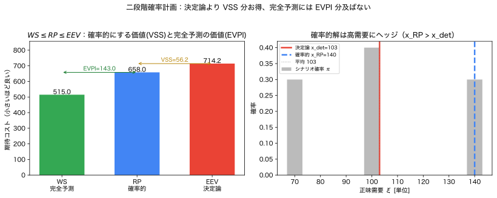
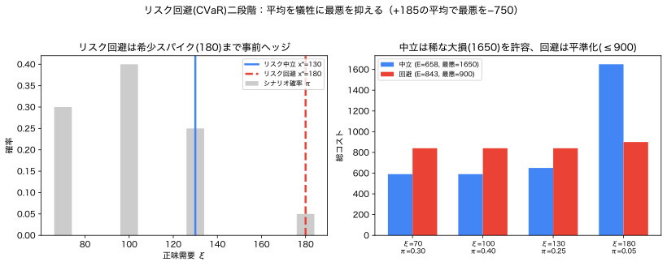

# Module 6b — 二段階確率計画と『確率的にする価値』

!!! abstract "30秒まとめ"
    - **何の話か**：いま決める＋後で直す（recourse）の二段階確率計画。
    - **分かること**：確率的に解く価値（VSS）と、完全情報の価値（EVPI）を数で出す。
    - **使う場面**：先に一部を決め、実現を見て残りを調整できるとき。 → [▶ 蓄電池ツール](../interactive/index.md)（σで予測の価値＝EVPI を体感）。

> **5つの問い**：①何が不確実か ②どの言語で表すか ③何を良しとするか ④式のどこに出るか ⑤代償は何か。
> この deep-dive は、Module 6 の②期待値最小化を **二段階（recourse 付き）** に拡張し、
> 「**決定論より確率的にして何が得られ、何を失うか**」を **VSS・EVPI** という数で答えます。

Module 6 の容量調達（newsvendor）は**単段**——一度決めたら終わり、でした。
しかし現実の電力運用は**二段階**です：**いま決め**（日前計画）、**不確実性が判明した後に調整する**（実時間）。
この「決めて・観測して・直す」構造を表すのが**二段階確率計画**です。

---

## 1. 現象・直感：いま全部決めるか、後で直せるか

マイクログリッドの運用者を考えます。明日の正味需要 $\xi$（需要−PV）は不確実。

- **日前（第1段, here-and-now）**：安い日前市場で電力 $x$ を**前もって**買う（価格 $c_1$）。$\xi$ はまだ不明。
- **実時間（第2段, recourse）**：$\xi$ が判明したら、**蓄電池**と**割高な実時間市場**（価格 $c_2 \gg c_1$）で帳尻を合わせる。

ここで2つの構えがある：

| 構え | 何をするか | 問題 |
|---|---|---|
| **決定論** | $\xi$ を平均と決め打ちして $x$ を選ぶ | 平均より高需要だと割高な実時間調達が増える |
| **二段階確率計画** | 全シナリオを見て、**recourse がある前提**で $x$ を選ぶ | 高需要シナリオに**事前にヘッジ**できる |

> **核心**：第2段で直せる（recourse）からこそ、第1段で**過度に保守的にならず**、かつ**平均だけで決めない**最適な $x$ がある。
> その「うまさ」を金額で測るのが **VSS（確率的にする価値）** です。

---

## 2. 数学的定義：二段階確率計画

一般形：
$$
\min_{x}\ \ c^\top x + \mathbb{E}_{\xi}\big[\,Q(x,\xi)\,\big],
\qquad
Q(x,\xi) = \min_{y\ge 0}\ \big\{\,q^\top y \ :\ W y = h(\xi) - T x\,\big\}.
$$
> **意味**：$x$ は**第1段決定**（不確実性を知る前に決める here-and-now 変数）。
> $Q(x,\xi)$ は**第2段の最適リコース費用**——$\xi$ が判明した後、$y$ で帳尻を合わせる最小費用。
> 目的は「第1段費用 ＋ リコース費用の期待値」。$\mathbb{E}$ で全シナリオを平均する。

有限シナリオ $\{(\xi_s,\pi_s)\}_{s=1}^S$ なら、**extensive form**（1つの大きな最適化）：
$$
\min_{x,\,y_1,\dots,y_S}\ c^\top x + \sum_{s=1}^S \pi_s\, q^\top y_s
\quad\text{s.t.}\quad W y_s = h(\xi_s) - T x,\ \ y_s\ge0\ \ (\forall s).
$$
> **意味**：シナリオごとに別々のリコース変数 $y_s$ を持たせ、第1段 $x$ は**全シナリオで共通**（non-anticipativity：未来を先取りして $x$ を変えてはいけない）。これを1つの線形計画として解く。

---

## 3. 図・表：3つの値と2つのギャップ


*図（左）WS=515 ≤ RP=658 ≤ EEV=714.2。VSS=EEV−RP=56.2（確率的にする価値）、EVPI=RP−WS=143（完全予測の価値）。（右）確率的解 $x_{RP}=140$ は決定論 $x_{det}=103$ より高需要にヘッジ。（再生成：`python scripts/06b_two_stage_vss_evpi.py`）*

二段階問題には、比較すべき3つの「解き方」があります。

```
コスト（小さいほど良い）
   WS ──────── RP ──────── EEV
   │           │            │
 完全予測    確率的       決定論
 (理想)     (現実的最善)  (平均で決め打ち)
   └─ EVPI ─┘└─── VSS ───┘
```

| 記号 | 名前 | 定義 | 意味 |
|---|---|---|---|
| **WS** | wait-and-see | $\mathbb{E}_\xi[\min_x (c^\top x + Q(x,\xi))]$ | 各シナリオを**知ってから**最適化（完全予測の理想） |
| **RP** | recourse problem | $\min_x (c^\top x + \mathbb{E}_\xi[Q(x,\xi)])$ | **二段階確率計画**の最適値（現実的な最善） |
| **EEV** | expected result of EV solution | $c^\top \bar x + \mathbb{E}_\xi[Q(\bar x,\xi)]$ | 平均で決めた $\bar x$ を全シナリオで採点 |

2つのギャップ：
$$
\boxed{\ \text{VSS} = \text{EEV} - \text{RP} \ge 0\ },\qquad
\boxed{\ \text{EVPI} = \text{RP} - \text{WS} \ge 0\ }.
$$
> **VSS（value of the stochastic solution）**：決定論（平均で決め打ち）を、確率的最適化に替えると**いくら得するか**。
> **EVPI（expected value of perfect information）**：完全な予測があれば**さらにいくら得するか**（＝不確実性が残すコスト）。
> 必ず $\text{WS} \le \text{RP} \le \text{EEV}$（確率的は決定論より良く、完全予測には及ばない）。

---

## 4. 数値例：蓄電池つき日前調達（手で追える）

**設定**（決定変数 $x$、不確実変数 $\xi$ を明記）
- **決定変数** $x\ge0$：日前に買う電力量（第1段）。第2段リコース $y=(\text{short},\text{surp},\text{store})$。
- **不確実変数** $\xi$：正味需要。**不確実性の表現＝シナリオ（離散分布）** $\xi\in\{70,100,140\}$、$\pi=\{0.3,0.4,0.3\}$（平均103）。
- 価格：日前 $c_1=5$、実時間 $c_2=20$（割高）。蓄電池：容量 $B=15$、余剰の救済価値 $v=4$。
- **目的＝期待値**（リスク中立）。**制約＝各シナリオで需給balance（確率的というより全シナリオで充足）**。

第2段リコース費用：
$$
Q(x,\xi) = c_2\max(\xi-x,0)\ -\ v\,\min(\max(x-\xi,0),\,B).
$$
> **意味**：不足 $\xi>x$ は実時間で $c_2$ 払う。余剰 $x>\xi$ は蓄電池に最大 $B$ だけ貯めて $v$ ずつ回収（残りは捨てる）。

**手計算**：
- 決定論は $\xi=103$ で $x$ を選ぶ → $\bar x=103$（不足0、余剰0）。費用 $5\cdot103=515$。
- その $\bar x=103$ を全シナリオで採点：
  - $Q(103,70)=-4\cdot\min(33,15)=-60$、$Q(103,100)=-4\cdot\min(3,15)=-12$、$Q(103,140)=20\cdot37=740$。
  - $\text{EEV}=515 + [0.3(-60)+0.4(-12)+0.3(740)] = 515 + 199.2 = \mathbf{714.2}$。
- 確率的（RP）：全シナリオを見て $x$ を選ぶと $x^\*_{RP}=140$（高需要にヘッジ）。費用 $5\cdot140 + [0.3(-60)+0.4(-60)+0]=700-42=\mathbf{658}$。
- 完全予測（WS）：各シナリオで最適に $x=\xi$（不足0・余剰0）。費用 $5\xi$。$\text{WS}=0.3\cdot350+0.4\cdot500+0.3\cdot700=\mathbf{515}$。

$$
\text{VSS}=714.2-658=\mathbf{56.2},\qquad \text{EVPI}=658-515=\mathbf{143}.
$$
> **解釈**：平均で決め打ち（$x{=}103$）より、確率的に決める（$x{=}140$）と **56.2 安くなる**（VSS）。
> さらに完全予測があれば **143 安くなる**（EVPI）＝不確実性が残しているコスト。
> 確率的解が $x{=}140$ と高めなのは、**割高な実時間調達を避けるため高需要に事前ヘッジ**するから。recourse があるので過剰投資にもならない。

---

## 5. Python による検証（cvxpy, extensive form）

```python
import numpy as np, cvxpy as cp
c1, c2, v, B = 5.0, 20.0, 4.0, 15.0
xi = np.array([70., 100., 140.]); pi = np.array([0.3, 0.4, 0.3])
mean_xi = float(pi @ xi)                      # 103

def Q(x, d):
    short = max(d-x,0); surp = max(x-d,0); store = min(surp,B)
    return c2*short - v*store

# RP: 二段階確率計画（extensive form）
x = cp.Variable(nonneg=True)
sh = cp.Variable(3,nonneg=True); su = cp.Variable(3,nonneg=True); st = cp.Variable(3,nonneg=True)
cons=[]
for s in range(3):
    cons += [x + sh[s] - su[s] == xi[s], st[s] <= su[s], st[s] <= B]
cp.Problem(cp.Minimize(c1*x + pi@(c2*sh - v*st)), cons).solve(solver=cp.CLARABEL)
RP, x_RP = float((c1*x + pi@(c2*sh - v*st)).value), float(x.value)

# EEV: 平均で決めた x_det を全シナリオで採点
xs = np.linspace(0,200,2001)
x_det = xs[np.argmin([c1*xx + Q(xx, mean_xi) for xx in xs])]   # 103
EEV = c1*x_det + sum(p*Q(x_det,d) for p,d in zip(pi,xi))

# WS: 各シナリオで完全情報のもと最適（ここでは x=ξ が最適）
WS = float(pi @ np.array([c1*d for d in xi]))                  # 不足0余剰0

print(f"WS={WS:.1f}  RP={RP:.1f} (x*={x_RP:.0f})  EEV={EEV:.1f}")
print(f"VSS = EEV-RP = {EEV-RP:.1f}   EVPI = RP-WS = {RP-WS:.1f}")
# 実際の出力: WS=515.0  RP=658.0 (x*=140)  EEV=714.2 / VSS=56.2  EVPI=143.0
```

**観察ポイント**
- 必ず $\text{WS}\le\text{RP}\le\text{EEV}$（515 ≤ 658 ≤ 714.2）。
- $c_2$（実時間価格）を 20→40 に上げると、離散シナリオでは $x^\*$ は**最悪シナリオ140で飽和**（既に全シナリオの不足を覆う完全ヘッジ点なので動かない）。一方、決定論($x{=}103$)の不足が割高化するため **VSS は 56.2→278.2 と急拡大**。「不足の罰が重いほど、ヘッジしない決定論の損が膨らむ」。
- 蓄電池容量 $B$ を増やすと余剰の救済が増え、$x^\*$ と費用が変わる（蓄電池の価値）。
- シナリオの分散を0にすると VSS→0（不確実性が無ければ決定論で十分）。

---

## 6. 電力・エネルギーへの接続

| 二段階の要素 | 電力での意味 |
|---|---|
| 第1段 $x$ | 日前計画：起動停止、日前市場約定、予約予備力、蓄電池充電計画 |
| 不確実性 $\xi$ | 正味需要、再エネ出力、価格、故障 |
| 第2段リコース $y$ | 実時間調整：出力再配分、蓄電池充放電、緊急融通、需要応答 |
| RP | 確率的 UC / 経済負荷配分の最適値 |
| VSS | 「確率的最適化を導入する投資対効果」の定量化 |
| EVPI | 「予測精度を上げる価値」の上限（予測投資の判断材料） |

> **設計の勘所**：VSS が小さい問題に確率的最適化を導入しても割に合わない（決定論で十分）。
> VSS が大きい（価格非対称・分散大・recourse が高くつく）問題こそ、確率計画の出番。
> **EVPI は「予測改善にいくら投資してよいか」の上限**を与える——確率モデルが経営判断に直結する好例。

---

## 7. 決定論と比べて何が得られ、何を失うか

| 観点 | 決定論（平均で決め打ち） | 二段階確率計画 |
|---|---|---|
| 得られるもの | 単純・高速・データ最小 | **VSS 分の費用削減**、recourse を見越した賢い第1段 |
| 失うもの | 平均の罠（高需要で割高調達） | シナリオが要る、**問題サイズが $S$ 倍**（extensive form）、期待値ゆえ尾部に鈍感 |
| データ要件 | 代表値1つ | シナリオ集合（質が命、Module 5） |
| 計算負荷 | 小 | 中〜大（シナリオ数に比例、削減技術が要る） |
| 保守性 | 低（楽観） | 中（recourse 前提で過度に保守的でない） |

> **失うものの最たるは「期待値ゆえ尾部に鈍感」**。最悪シナリオの大損を抑えたいなら、
> 第2段費用に **CVaR** を入れた**リスク回避二段階**にする（$\min_x c^\top x + \mathrm{CVaR}_\alpha[Q(x,\xi)]$）。Module 6 §6 と接続。

---

## 8. 発展：リスク回避型二段階（CVaR 二段階）

ここまでは**リスク中立**（期待値最小化）でした。しかし「平均は良いが**稀に破滅的**」な解は危険です。
Module 3 の **CVaR**（尾部の平均）を第2段費用に入れると、**リスク回避型二段階**になります。

### 8.1 定式化（決定変数・目的・制約を明示）
- **決定変数**：第1段 $x\ge0$、第2段リコース $y_s$、CVaR 補助変数 $\eta,\,u_s$。
- **不確実変数**：$\xi$（シナリオ $\{(\xi_s,\pi_s)\}$）。
- **目的（CVaR 最小化）**：
$$
\min_{x,\eta,u_s,y_s}\ \ \eta + \frac{1}{1-\alpha}\sum_s \pi_s\,u_s
\quad\text{s.t.}\quad u_s \ge \big(c^\top x + q^\top y_s\big) - \eta,\ \ u_s\ge0,
$$
かつ各シナリオの第2段制約（需給balance・蓄電池容量）。
> **意味**：総費用 $c^\top x + q^\top y_s$ の**最悪 $(1-\alpha)$ の平均（CVaR$_\alpha$）**を最小化する（Rockafellar–Uryasev、Module 3 §8）。
> 制約は各シナリオで満たす（**最悪ケース満足ではなく、全シナリオ満足＋目的で尾部を抑制**）。

### 8.2 数値例：希少な高需要スパイク
§4 の蓄電池問題に、**稀な高需要 180**（確率5%）を加える：$\xi\in\{70,100,130,180\}$、$\pi=\{0.30,0.40,0.25,0.05\}$。


*図（左）リスク回避は希少スパイク180まで事前ヘッジ（$x^\*$ が130→180）。（右）中立は稀な大損1650を許容、回避は総コストを≤900に平準化。（再生成：`python scripts/06c_risk_averse_two_stage.py`）*

| | 第1段 $x^\*$ | 期待総費用 | 最悪シナリオ費用 | 各シナリオ費用 |
|---|---|---|---|---|
| **リスク中立**（E最小） | 130 | **658** | **1650** | [590, 590, 650, **1650**] |
| **リスク回避**（CVaR$_{0.9}$） | 180 | 843 | **900** | [840, 840, 840, 900] |

> **読み方**：リスク中立は期待658と安いが、5%の確率で**1650の大損**（180の需要に130しか備えず実時間で50×20=1000を払う）。
> リスク回避は $x$ を180まで上げて全シナリオの不足を消し、**最悪を900に平準化**。代償は期待が $658\to843$（**+185**）。
> **+185の平均コストで、最悪を $1650\to900$（−750）に抑える**——これが尾部リスクへの保険料。$\alpha$ を上げるほど保守的に。

### 8.3 いつリスク回避にするか
- **破滅的・回復不能**な損失（大規模停電、設備全損、債務超過）を避けたいとき。
- 規制・契約で**最悪ケースの上限**が課されるとき。
- 一方、損失が小さく頻繁に均されるなら、リスク中立（期待値）で十分（保険料の無駄を避ける）。

> **位置づけ**：これは Module 6 の二軸マップで「分布（③目的＝尾部 CVaR）×二段階（recourse）」のマス目。
> Module 3（CVaR）と Module 6b（二段階）を**1つの定式化に統合**したもの。比較ツール `apps/stochastic_optimization_comparator`（単段）の二段階・尾部版にあたる。

---

## 9. 理解確認問題

> 解答：[`exercises/solutions/06b_two_stage_solutions.md`](../exercises/solutions/06b_two_stage_solutions.md)

### 初級
1. 二段階確率計画の「第1段決定」と「第2段リコース」を、蓄電池運用の言葉で1つずつ例示せよ。
2. WS・RP・EEV の大小関係を不等式で書き、各々が何を表すか1文で述べよ。
3. §4 の数値で VSS と EVPI を計算し、それぞれの意味を述べよ。

### 中級
4. 実時間価格 $c_2$ を 20→40 に上げると、確率的解 $x^\*$ と VSS はどう変わると予想されるか。理由とともに述べよ（Python で確認可）。
5. 「VSS が小さい問題では確率的最適化を導入する意味が薄い」とはどういう状況か。分散・非対称性の観点で説明せよ。
6. non-anticipativity（第1段 $x$ を全シナリオ共通にする制約）を外すと、何が起きるか。それが WS に対応する理由を述べよ。

### 発展
7. EVPI が「予測改善への投資上限」を与えるとはどういう意味か。EVPI=143 の問題で、予測精度向上に年間いくらまで投資してよいか論ぜよ（仮定を明示）。
8. この二段階問題を**リスク回避版**（第2段費用の CVaR を最小化）に変える定式化を書け。期待値版と比べ、$x^\*$ はどちらに動くと予想されるか。決定変数・目的・制約を明示せよ。

---

## 10. よくある誤解

| 誤解 | 正しい理解 |
|---|---|
| 第1段で全部決める | 第2段で recourse がある。だから第1段は「直せる前提」で選ぶ。 |
| 確率的＝完全予測 | 確率的(RP)は完全予測(WS)に及ばない。差が EVPI。 |
| VSS は常に大きい | 分散小・対称なら VSS≈0（決定論で十分）。 |
| 期待値最小化なら安心 | 尾部に鈍感。大損回避は CVaR 版へ。 |
| シナリオを増やせば必ず良い | extensive form が $S$ 倍に膨張。削減技術が要る（Module 5 §6）。 |

---

## 章末セルフチェック

自分で答えてから開いてください（[▶ 蓄電池ツール](../interactive/index.md)で σ を上げると EVPI が出る）。

??? question "Q1. recourse（リコース）とは？"
    不確実性が**判明した後**に取れる修正行動（第2段の決定）。「いま決め→観測→直す」の二段階構造。

??? question "Q2. VSS と EVPI はどう違う？"
    **VSS**＝確率的に解く価値（EEV−SP：決定論で立てるより確率計画がどれだけ得か）。**EVPI**＝完全情報の価値（SP−WS：先に未来が分かればどれだけ得か）。

## 11. まとめと次の一手

- 二段階確率計画は「**いま決め（$x$）→ 観測 → 直す（$y(\xi)$）**」を表す。recourse が第1段を賢くする。
- **VSS = EEV − RP**：決定論より確率的にして得する額。**EVPI = RP − WS**：完全予測で更に得する額。$\text{WS}\le\text{RP}\le\text{EEV}$。
- 決定論より得るのは VSS、失うのはシナリオ・計算量・尾部感度。尾部が要るなら CVaR 版へ。

> **次へ**：本 deep-dive で「期待値版の二段階」を固めました。リスク回避（CVaR 二段階）、多段階、
> そして蓄電池の**多時間帯 SoC ダイナミクス**を入れた運用ツールが自然な発展です（`apps/` 拡張）。
> Module 6 本体 [06_optimization_under_uncertainty](06_optimization_under_uncertainty.md) の6形式比較と合わせて読むと、二軸（表現×目的）の地図が完成します。

### この deep-dive で「言えたら合格」
> 「二段階確率計画は第1段 $x$ ＋ 第2段リコース $y(\xi)$。確率的にする価値は VSS=EEV−RP、完全予測の価値は EVPI=RP−WS で、必ず WS≤RP≤EEV。決定論より VSS 分得し、代わりにシナリオと計算量を払う。」
