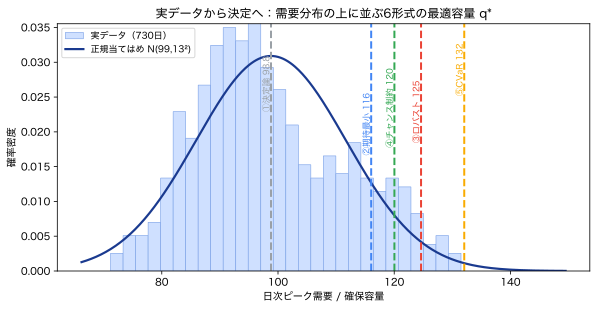

# ケーススタディ — 実データから決定まで

!!! abstract "30秒まとめ"
    - **何の話か**：本物のデータ（730日の日次ピーク需要）から、**決定まで一気通貫**でやる。
    - **分かること**：データ→分布→6形式の容量決定。**平均で決めると期待損失が40%余計**。
    - **使う場面**：手元データで「どれだけ確保するか」を実際に決めるとき。 → [▶ コンパレータ](../interactive/index.md) で同じ問題を動かす。

第0章–6 で部品はそろいました。ここでは **`data/daily_peak_demand.csv`（実データ）** を使い、
**観測 → 分布 → 6形式の決定 → 解釈** を最後まで通します。数値はすべて
[`scripts/case_study_capacity.py`](https://github.com/lutelute/lec_prob/blob/main/scripts/case_study_capacity.py) の出力で、`python scripts/case_study_capacity.py` で再現できます。

## ① データを見る（第4章）

730日分の日次ピーク需要。要約統計は：

| 量 | 値 |
|---|---|
| 標本数 | 730 日 |
| 平均 $\hat\mu$ | 98.80 |
| 標準偏差 $\hat\sigma$ | 12.91 |
| 歪度 | +0.40（やや右に裾） |
| 超過尖度 | −0.56 |

**観測は真の分布ではありません**（第4章）。これは730日という有限標本で、$\hat\mu,\hat\sigma$ 自体に推定誤差があります。

## ② 分布に当てはめる（第2章）

第一近似として正規分布 $N(98.8,\,12.9^2)$ を当てます。歪度 +0.40 はわずかに右に裾がある合図で、
**不足側（高需要）をやや過小評価**しがちです——だから後で「保守側の形式」が効いてきます。

## ③ 6形式で「確保容量」を決める（第6章）

不足コスト $c_s=10$ ≫ 余剰コスト $c_o=1$（臨界比 $c_s/(c_s+c_o)=0.909$）。
同じデータ・同じコストでも、**何を大事にするか**で最適容量 $q^\*$ は変わります：

| 形式 | 何を大事にするか | $q^\*$ | 供給不足の確率 |
|---|---|---|---|
| ①決定論 | 平均だけ | 98.8 | **50.0%** |
| ②期待コスト最小 | 平均的な損 | 116.0 | 9.1% |
| ⑥分布ロバスト（Scarf） | 平均と分散しか信じない | 117.2 | 7.7% |
| ④チャンス制約（ε=5%） | 不足を5%以下に | 120.0 | 5.0% |
| ③ロバスト（箱 ±2σ） | 最悪需要に備える | 124.6 | 2.3% |
| ⑤CVaR最小（α=95%） | 大きな不足の平均を抑える | 132.1 | 0.5% |

「不確実性をどう表すか × 何を最適化するか」で、**98.8 から 132 まで**動きます。
①→⑤は「不確実性を無視」から「裾まで強く備える」への連続的なスペクトルです。

## ④ 解釈：平均で決める代償

平均ぴったり（98.8）で確保すると、**半分の日が供給不足**。期待損失で比べると：

| 決め方 | 期待損失 |
|---|---|
| 平均で決める（①） | 56.65 |
| 期待コスト最小（②） | 40.47 |

**平均で決めるだけで 40% 余計に損**をします（不足が余剰より痛いのに、平均は両者を対称に扱うから）。
これが 第0章の「平均の罠」が、実データ・実決定で表れた姿です。

> **このケースの教訓**：分布の中心（平均）でなく、**コストの非対称性と「許容するリスク」**が容量を決める。
> 形式の選択は技術ではなく**価値判断**——だから6つを並べて比べる（[▶ コンパレータ](../interactive/index.md)）。

## ⑤ PV を入れると：相関が効く（第3章）

太陽光（PV）があると、備えるべきは需要そのものでなく**正味需要**（needからPV発電を引いた量）です。
2つ目の実データ `data/pv_daily_factor.csv`（PV利用率）を使い、設置容量40で
$\text{正味需要}=\text{需要}-40\times\text{PV利用率}$ を作ると：

| 量 | 需要のみ | 正味需要（PVあり） |
|---|---|---|
| 平均 | 98.8 | **91.8**（↓7.0） |
| 標準偏差 | 12.9 | **14.9**（↑2.0） |
| 期待最小の確保量 $q^\*$ | 116.0 | 111.7 |

PVは**平均**を下げます（確保量も 116→112 へ）。ところが**ばらつきは増えました**。鍵は相関：

$$ \mathrm{Cov}(\text{需要},\text{PV})<0\quad(\rho=-0.47). $$

高需要の日ほどPVが弱い（曇り・冬）ため、両者は**打ち消し合わず重なり**、
$\mathrm{Var}(\text{正味})=\mathrm{Var}(D)+C^2\mathrm{Var}(\text{PV})-2C\,\mathrm{Cov}(D,\text{PV})$ の
最後の項が**負の相関で符号反転して分散を増やす**のです（第3章）。

> **教訓**：「PVを入れたから安心」ではない。**平均は下がるが、需要と負相関なら裾（最悪）はむしろ悪化**しうる。
> 平均だけでなく**相関と分散**を見ないと、必要な予備力を読み違える。

## 再現とつながり

- 数値：`python scripts/case_study_capacity.py`、図：`python scripts/fig_case_study.py`
- 理論：[第4章（データ→分布）](04_from_data_to_distribution.md)・[第6章（6形式）](06_optimization_under_uncertainty.md)
- 二段階に拡張（後で直せるなら？）：[第6b章](06b_two_stage_stochastic_programming.md)
