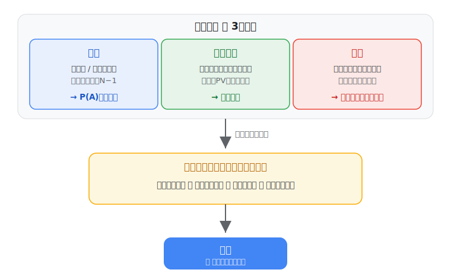

# 確率の使い方

確率は「曖昧」を「具体的な決定」に変える言語です。未来を当てる道具ではありません。
「不確実」はひとつではなく、**事象**（起こる/起こらない）・**ばらつき**（量の揺れ、減らせない）・**誤差**（知らないこと、情報で減る）と顔が違い、表し方も違います。

!!! question "「分布をどう数値で扱うのか／確定論・確率・シナリオ法が分からない」人へ"
    まず [🔢 分布を数値でどう扱うか](distributions_and_methods.md) を読んでください。**分布はスカラーではなく地図**で、操作（和／積分）でスカラーを取り出すこと、手法の違いを、手で追える数値で説明します。

{ width="620" }

そして決定は、**「何を大事にするか」を選んで初めて**決まります。下のツールで触って確かめてください。

## 触って学ぶ：何を大事にするかで、決定が変わる

「ばらつき」のケース——明日のピーク需要 $D\approx100\pm15$ に、容量をどれだけ確保するか。
**スライダーを動かす**と供給不足の確率とコストが変わります。立場のボタンも押してみてください。

<iframe id="decideframe" src="../../interactive/decide.html" title="触って学ぶ：確率→決定" style="width:100%;height:640px;border:1px solid #dadce0;border-radius:10px"></iframe>

平均ぴったり（100）は半分の日が供給不足。不足が余剰より痛いぶん、平均より多めが正解——同じ状況でも重視点で決定が変わる。これが「確率を使う」ということです。

→ 6形式すべての比較は [▶ コンパレータ](../interactive/index.md)。「事象」（故障率・停電）は [第1章](01_events_and_probability.md)・[ベイズ](../interactive/index.md)、「誤差」（推定の不確かさ）は [第4章](04_from_data_to_distribution.md) へ。
