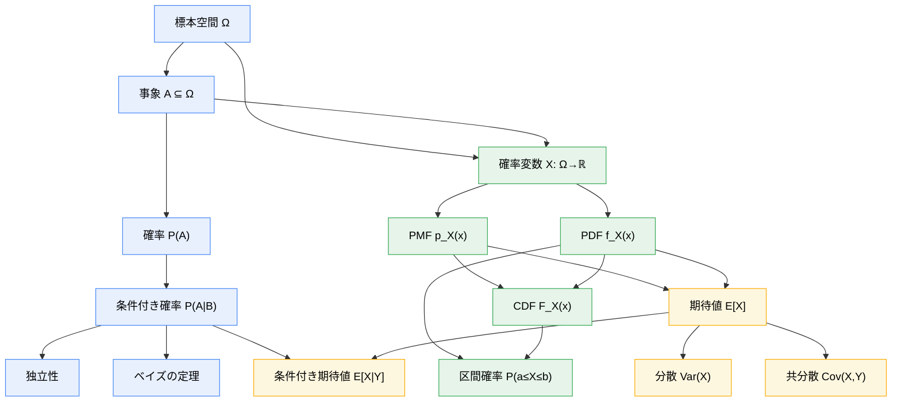
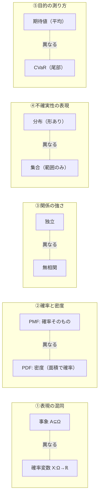
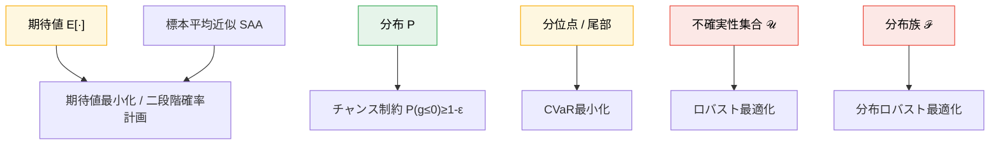

# 概念地図

[`learning_map.md`](learning_map.md) が「章の順序」を示すのに対し、
ここでは**概念どうしの細かい依存と対応**を示します。「この概念は、結局どの概念の言い換えなのか」を見える化します。

---

## 1. 確率の中心概念グラフ

---

## 2. 「同じことを別の言葉で言っている」対応表

学習者がつまずく原因の多くは、**同じ概念が文脈ごとに別名で出てくる**ことです。

| 確率の言葉 | データの言葉 | 最適化の言葉 | 電力システムの例 |
|---|---|---|---|
| 確率変数 $X$ | 観測される量 | 不確実パラメータ $\xi$ | 翌日の最大需要 |
| 分布 $f_X$ | 母集団 | 確率モデル $\mathbb{P}$ | 需要の確率モデル |
| 標本 $x_1,\dots,x_n$ | データ | シナリオ $\xi_1,\dots,\xi_S$ | 過去の需要記録 |
| 期待値 $E[X]$ | 標本平均 $\bar{x}$ | 平均コスト | 平均運用費 |
| 分位点 $q_\alpha$ | パーセンタイル | VaR | 95%ile 需要 |
| 裾の重さ | 外れ値の出やすさ | 尾部リスク / CVaR | 猛暑日の需要急増 |
| 事象 $\{X>c\}$ | 閾値超え | 制約違反 $\{g>0\}$ | 系統容量オーバー |
| $P(X>c)$ | 超過頻度 | 違反確率 | 供給支障確率 |

> この表を**右に読む**と「確率の基礎が、最終的に最適化のどの部品になるか」が分かります。
> 第6章でつまずいたら、この表で**左に戻って**確率の言葉に翻訳し直してください。

---

## 3. 区別すべき「似て非なるもの」マップ

各ペアは、対応するノートで**最小の反例**とともに解説します。

| 混同 | どこで解消するか | 解消の鍵 |
|---|---|---|
| ① 事象 vs 確率変数 | `01` | 集合か写像か |
| ② 確率 vs 密度 | `02` | 足して1か積分して1か |
| ③ 独立 vs 無相関 | `03` | 独立⇒無相関、逆は不成立（非線形依存の反例） |
| ④ 分布 vs 集合 | `06` | 重み付きか範囲だけか |
| ⑤ 期待値 vs CVaR | `03`, `06` | 中心か裾か |

---

## 4. 「最適化形式」が確率概念に依存している様子

各最適化形式は「どの確率概念を土台にするか」が異なります。
**最適化が難しいのではなく、土台の確率概念が曖昧だと最適化が選べない**、というのがこの教材の立場です。

---

関連：[`learning_map.md`](learning_map.md)、[`optimization_map.md`](optimization_map.md)、[`notation.md`](notation.md)。
