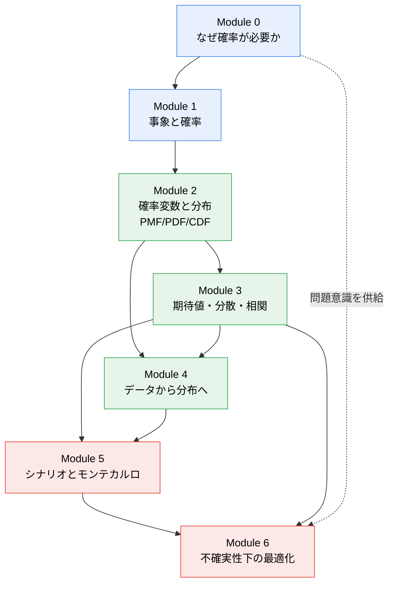
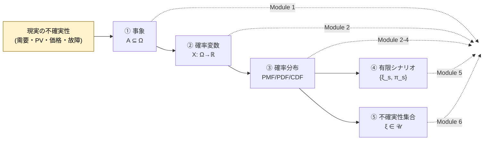
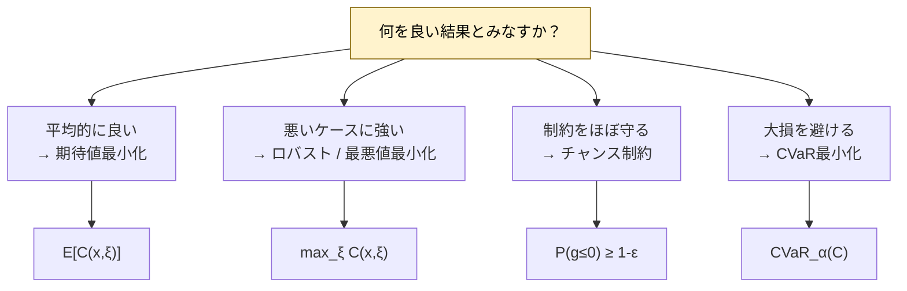
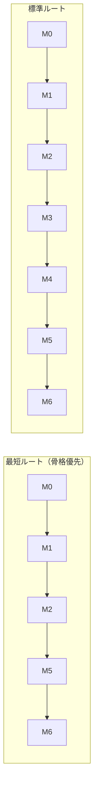

# 学習地図

確率から確率的最適化までを、**概念の依存関係**として地図化します。
矢印 `A → B` は「A を理解していないと B でつまずく」を意味します。

---

## 1. モジュール依存グラフ

- **青（基礎）**：確率の言語そのもの。
- **緑（中核）**：確率変数・分布・期待値・データ。ここが厚いほど後が楽。
- **赤（応用）**：シナリオと最適化。電力システムへの接続点。

---

## 2. 「不確実性をどう表すか」の5つの言語

この教材の背骨は、**同じ不確実性を5通りの言語で表せる**という点です。
モジュールが進むにつれ、表現の解像度と用途が変わります。

| 言語 | いつ使うか | 代表モジュール | 最適化での役割 |
|---|---|---|---|
| ① 事象 | 「起こる／起こらない」の二分 | M1 | 故障の有無、ピーク発生 |
| ② 確率変数 | 結果に数値を割り当てたい | M2 | 需要量・出力量そのもの |
| ③ 確率分布 | ばらつき方の全体像が要る | M2–M4 | 期待値・チャンス制約・CVaR |
| ④ 有限シナリオ | 分布を計算可能な形に落とす | M5 | シナリオベース確率計画 |
| ⑤ 不確実性集合 | 分布を仮定したくない／最悪に備える | M6 | ロバスト最適化 |

> **核心**：④は③を「捨てている」のではなく**離散近似**している。⑤は③の「形」を捨て、**範囲だけ**を残している。
> この違いが、期待値最小化・CVaR（③系）とロバスト最適化（⑤系）の分かれ目になります。

---

## 3. 「何を良しとするか」の4つの基準

最適化の形式は、結局**目的をどう測るか**で決まります。

詳細は [`optimization_map.md`](optimization_map.md)。

---

## 4. 推奨学習ルート

- **最短**：まず「不確実性の表し方」と「最適化での使い方」を通す。期待値・分散の詳細は後追い。
- **標準**：積み上げ式。Module 3（期待値・分散・相関）と Module 4（データ）を飛ばさない。
- **応用逆算**：Module 6 冒頭の比較表を先に読み、未知語を 02–05 で回収。

---

## 5. 各モジュールの「これが言えたら合格」チェック

| Module | このひと言が自分の言葉で言えたら合格 |
|---|---|
| 0 | 「決定論モデルは ___ のとき壊れる。だから確率が要る」 |
| 1 | 「事象は $\Omega$ の部分集合、確率変数は $\Omega$ 上の関数。だから別物」 |
| 2 | 「$f_X(x)$ は確率ではなく密度。確率は区間の面積」 |
| 3 | 「平均が同じでも分散・CVaR が違えばリスクが違う」 |
| 4 | 「ヒストグラムは観測の要約、分布は母集団の仮定。両者は一致しない」 |
| 5 | 「シナリオは分布の離散近似。サンプルに極端事象が無いと尾部が見えない」 |
| 6 | 「この問題で私が ___ を重視するから、___ 形式を選ぶ」 |

---

関連：[`concept_map.md`](concept_map.md)（概念どうしの細かいつながり）、[`notation.md`](notation.md)（記号）。
