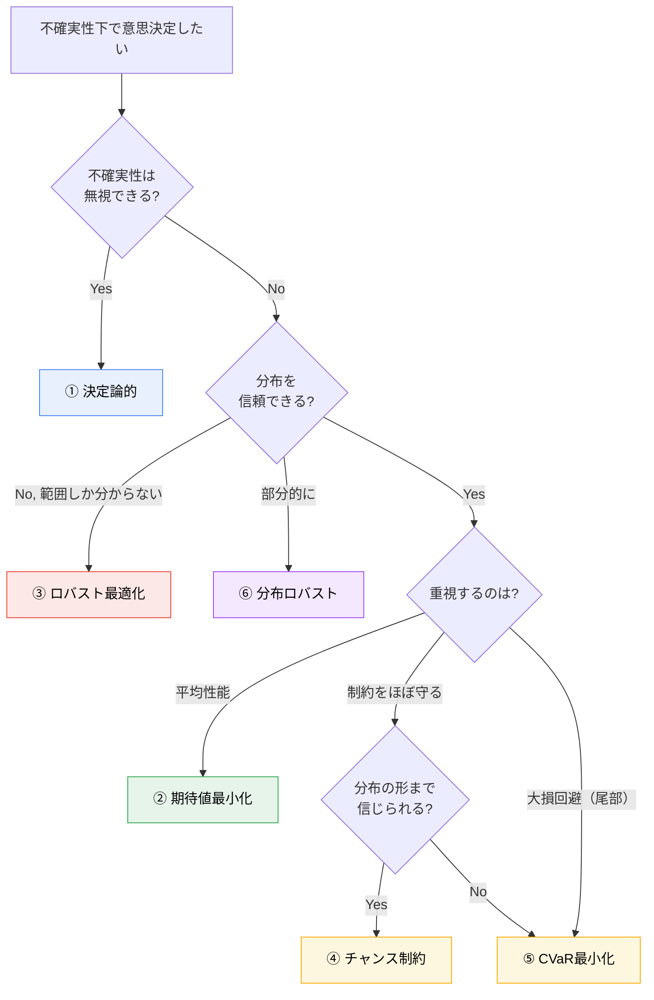

# 最適化地図

不確実性下の最適化を、**2つの軸**で整理します。

- **横軸：不確実性をどう表すか** — 点（決定論） / 分布 / 集合 / 分布族
- **縦軸：何を最適化するか** — 平均 / 尾部 / 制約違反確率 / 最悪値

この2軸さえ押さえれば、6形式は「別々の難しい手法」ではなく**1枚の地図上の点**になります。

---

## 1. 二軸マップ

```
                 不確実性の表現 →
              点         分布            集合          分布族
            (1シナリオ)  (重み付き)      (範囲のみ)    (分布の集合)
          ┌──────────┬───────────────┬────────────┬──────────────┐
   平均   │ 決定論的  │ 期待値最小化   │            │ 分布ロバスト  │
   E[·]   │ min f(x) │ min E[C(x,ξ)]  │            │ min sup E_P[C]│
          ├──────────┼───────────────┼────────────┼──────────────┤
   尾部   │          │ CVaR最小化     │            │ (DR-CVaR)    │
   CVaR   │          │ min CVaR_α(C)  │            │              │
          ├──────────┼───────────────┼────────────┼──────────────┤
  違反確率 │          │ チャンス制約    │            │ (DR-CC)      │
  P(g≤0)  │          │ P(g≤0)≥1-ε     │            │              │
          ├──────────┼───────────────┼────────────┼──────────────┤
   最悪値  │          │               │ ロバスト    │              │
  max C   │          │               │ min max C  │              │
          └──────────┴───────────────┴────────────┴──────────────┘
```

- 空欄は「概念的には作れるが、本教材の主対象ではない」組み合わせ。
- 括弧つき（DR-CVaR, DR-CC）は発展的な合わせ技。第6章 後半で触れる。

---

## 2. 大比較表（6形式）

> 各形式について、**「何を $\xi$ とするか／表現／目的／制約／保守性／計算量／必要データ／崩れる場面」**を必ず揃えます。

| 観点 | ① 決定論的 | ② 期待値最小化 | ③ ロバスト最適化 | ④ チャンス制約 | ⑤ CVaR最小化 | ⑥ 分布ロバスト |
|---|---|---|---|---|---|---|
| **定式化** | $\min_x f(x)$ | $\min_x E[C(x,\xi)]$ | $\min_x \max_{\xi\in\mathcal{U}} C$ | $\min_x f$ s.t. $P(g\le 0)\ge 1-\varepsilon$ | $\min_x \mathrm{CVaR}_\alpha(C)$ | $\min_x \sup_{\mathbb{P}\in\mathcal{P}} E_{\mathbb{P}}[C]$ |
| **不確実性 $\xi$** | 無視（代表値） | 確率変数 | 集合の元 | 確率変数 | 確率変数 | 確率変数（分布が曖昧） |
| **表現** | 点推定 | 分布 $\mathbb{P}$ | 集合 $\mathcal{U}$ | 分布 $\mathbb{P}$ | 分布 $\mathbb{P}$ | 分布族 $\mathcal{P}$ |
| **目的が見る所** | 1点 | 平均 | 最悪値 | （平均＋）違反率 | 尾部の平均 | 最悪分布の平均 |
| **制約の守り方** | 代表値で | 平均的に / 各シナリオ | 常に（集合内すべて） | 確率 $1-\varepsilon$ で | 目的で尾部を抑制 | 最悪分布でも |
| **保守性** | 低（楽観的） | 中 | 高（しばしば過剰） | 中（$\varepsilon$ で調整） | 中〜高（$\alpha$ で調整） | 高（$\mathcal{P}$ で調整） |
| **計算量** | 小 | 中（SAAでLP/MILP） | 中（双対化でLP/SOCP） | 大（一般に非凸） | 中（凸：Rockafellar–Uryasev） | 中〜大（双対化が必要） |
| **必要データ／仮定** | 代表シナリオ1つ | 分布 or 多数サンプル | 範囲（上下限など） | 分布 or サンプル | 分布 or サンプル | 部分情報（モーメント等） |
| **崩れる場面** | 不確実性が大きい時 | 分布が誤り／尾部が重い | 集合が広すぎ非現実的 | 分布誤り／非凸で解けない | 分布誤り／$\alpha$ 選定 | $\mathcal{P}$ が広すぎ保守的 |
| **電力の典型** | 点予測のみで運用 | 多数シナリオで平均費用最小 | 最悪PV欠損でも需給維持 | 95%で容量制約遵守 | 高価格時の損失抑制 | 分布が不確かなPV出力 |

---

## 3. 「どれを選ぶか」決定フロー



> このフローは**出発点**であって絶対則ではありません。
> 実務では複数形式を解いて比較するのが正攻法です（第6章の比較ツールがこれを支援します）。

---

## 4. リスク指標の直感（同じ分布上で）

コスト $C$ の分布を考えたとき、各形式が「分布のどこを見るか」：

```
 確率密度
   │          期待値最小化はここ（重心）
   │              ↓
   │           ╱▔▔╲
   │          ╱     ╲          ← CVaR_0.95 はこの斜線部の平均
   │        ╱         ╲___      ← VaR_0.95 はこの境界線
   │      ╱              ╲░░░╲
   │___╱                  ╲░░░░╲___  ← ロバストは右端（最悪値）を見る
   └─────────────────────────────────→ コスト C
        小                        大
```

- **期待値**：分布の重心。尾の重さに鈍感。
- **VaR$_\alpha$**：「上位 $(1-\alpha)$ に入る境界値」。境界そのものなので、その先の深さを見ない。
- **CVaR$_\alpha$**：「上位 $(1-\alpha)$ の平均」。尾の**深さ**まで見る。VaR より保守的で、かつ凸（最適化しやすい）。
- **最悪値（ロバスト）**：右端。集合 $\mathcal{U}$ の取り方で決まる。

詳しい定義・手計算・Python・電力例は `notes/03_expectation_variance_covariance.md` と `notes/06_optimization_under_uncertainty.md`。

---

## 5. この地図の使い方

1. 新しい問題に出会ったら、まず**横軸**（分布を信じられるか？範囲だけか？）を決める。
2. 次に**縦軸**（平均でいいか？最悪に備えるか？制約遵守か？大損回避か？）を決める。
3. 交点が、出発点の定式化。
4. 余裕があれば隣のマス目も解いて、**結果がどう変わるか**を見る。

---

関連：[`learning_map.md`](learning_map.md)、[`concept_map.md`](concept_map.md)、[`notation.md`](notation.md)、`notes/06_optimization_under_uncertainty.md`。
